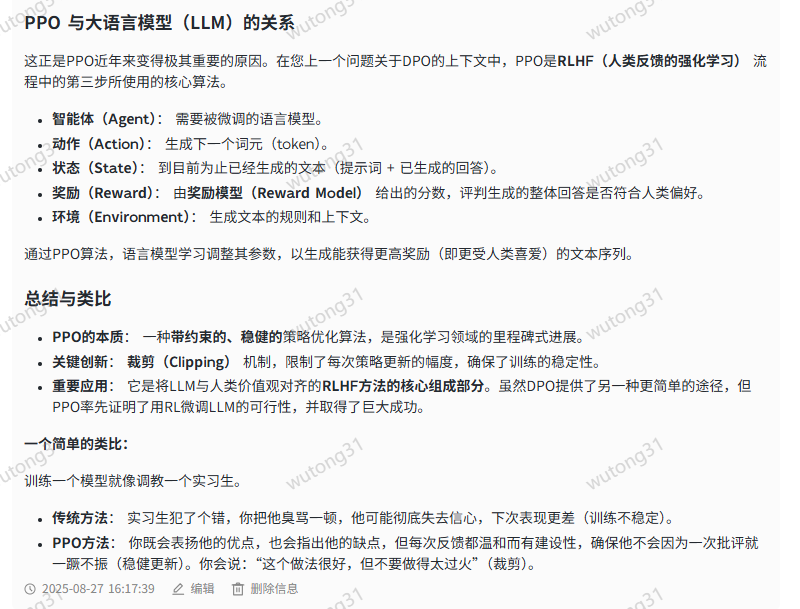
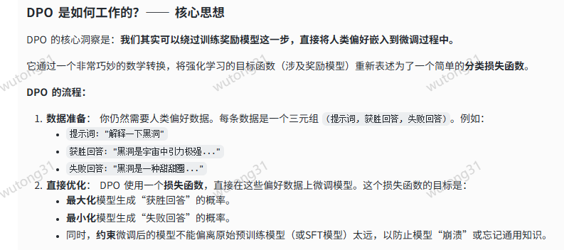

RLHF 的三步流程：

监督微调（SFT）： 在一个高质量的数据集上微调一个预训练好的基础模型（如GPT），教它如何遵循指令、进行对话。
训练奖励模型（RM）： 这是关键且昂贵的一步。需要收集大量的人类偏好数据（即对于同一个问题，给出两个回答，让人来选择哪个更好）。然后用这些数据训练一个单独的“奖励模型”，这个模型学会预测人类更喜欢哪个回答（即给更好的回答打更高的分数）。
强化学习（RL）微调： 使用第一步的SFT模型作为初始模型，使用第二步的奖励模型作为“裁判”。通过PPO等强化学习算法，让模型生成回答，然后由奖励模型打分，模型根据分数不断调整自己的参数，以生成能获得更高奖励（即更符合人类偏好）的回答。
---

为什么需要 PPO？—— 理解背景
在PPO出现之前，传统的策略梯度方法（Policy Gradient Methods）存在一个主要问题：

训练不稳定： 智能体的策略（可以理解为其“大脑”或决策函数）每次更新时，变化可能过大。这就像学走路时，如果一步迈得太大，很容易摔倒。在RL中，一次糟糕的更新可能会导致智能体性能急剧下降，并且很难恢复到之前的水平，甚至导致整个训练过程失败。
PPO就是为了解决这个稳定性问题而设计的。它通过数学约束，确保每次策略的更新都只迈出“一小步”，不会偏离当前的策略太远，从而保证训练的稳定性和可靠性。

PPO 是如何工作的？—— 核心思想
PPO的核心在于其独特的目标函数（Objective Function），这个函数包含了一个**裁剪（Clipping） 机制**。
我们来分解一下它的工作流程：

交互与收集数据： 智能体在当前策略下与环境交互，产生一系列的数据（状态、动作、奖励）。
计算优势函数： 评估在某个状态下，采取某个动作比平均情况“好”多少。正值表示该动作比预期好，负值则表示更差。
计算策略更新比率： 这是关键一步。比率 = （新策略下采取某个动作的概率） / （旧策略下采取某个动作的概率）。
如果比率 > 1：说明新策略更倾向于采取这个动作。
如果比率 < 1：说明新策略更不倾向于采取这个动作。
应用裁剪目标函数： PO不是简单地鼓励好的动作、抑制坏的动作。它通过一个裁剪区间（通常是[0.8, 1.2]）来约束这个比率。
如果一个动作非常好（优势值很高），但新策略已经过于偏爱它（比率远大于1），PPO会将其裁剪掉，防止更新过于激进。
如果一个动作非常差（优势值很低），但新策略已经过于排斥它（比率远小于1），PPO也会将其裁剪掉，同样防止更新过于激进。
这个裁剪机制的妙处在于： 它只对那些“好得离谱”或“差得离谱”的极端更新进行限制，对于大多数合理的更新则不予干涉。这样就实现了 “稳健地迈出一小步” 的目标。

---
核心定义
DPO（Direct Preference Optimization），中文可译为“直接偏好优化”。它是一种用于对齐（Align） 大型语言模型（LLM）与人类偏好（例如，更受欢迎、更无害、更有帮助的回答）的机器学习算法。
---
简单来说，它是一种无需训练奖励模型（Reward Model），即可直接根据人类偏好数据来微调模型的方法

---

RLHF (老师教学生)： 先请一个评分考官（奖励模型）学会打分标准，然后让学生（LLM）做题，考官评分，学生根据分数调整自己的答题思路。这个过程很迂回。
DPO (老师直接教学生)： 老师直接拿着标准答案（获胜回答） 和错误答案（失败回答） 告诉学生：“你要像这样答，不要像那样答”。老师直接把知识灌输给了学生，更加直接高效。