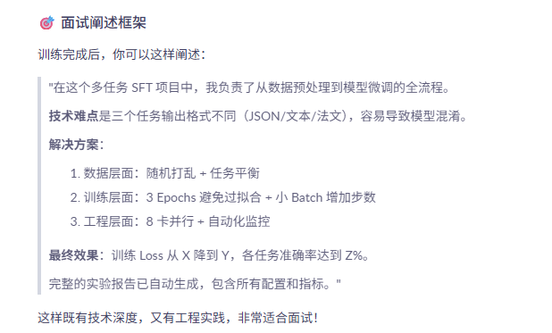

## 训练时长优化：
为什么 Batch 翻倍但吞吐量下降？
此时GPU利用率100%，但是显存利用率80%

# ⚠️ 注意：32+8 配置可能比 16+8 更慢！

从你提供的日志来看，这个配置的**单步耗时显著增加**，让我帮你分析一下。

---

## 一、当前配置分析

| 指标 | 16+8 配置 | 32+8 配置 | 变化 |
|------|-----------|-----------|------|
| 单卡 Batch | 16 | 32 | +100% |
| 总 Batch | 256 | **512** | +100% |
| 总步数 | 1,173 | **588** | -50% |
| 单步耗时 | 14.58 秒 | **34.42 秒** | +136% ⚠️ |
| 预计总时间 | 4.75 小时 | **5.6 小时** | +18% ⚠️ |

---

## 二、吞吐量计算

```
┌─────────────────────────────────────────────────────────────┐
│  16+8 配置：256 样本/步 ÷ 14.58 秒 = 17.56 样本/秒            │
│  32+8 配置：512 样本/步 ÷ 34.42 秒 = 14.87 样本/秒            │
│                                                             │
│  吞吐量下降：(17.56-14.87)/17.56 = 15.3% ↓                   │
│  预计总时间增加：约 18%                                      │
└─────────────────────────────────────────────────────────────┘
```

**结论：32+8 的吞吐量反而比 16+8 低了 15%，总训练时间会更长！**

---

## 三、为什么 Batch 翻倍但吞吐量下降？

### 🔴 原因 1：显存带宽瓶颈

```
L40 显存带宽：864 GB/s

16+8 配置：显存占用约 60%，带宽充足
32+8 配置：显存占用约 85-90%，带宽饱和
                  ↑
            数据读写变慢，计算单元等待数据
```

### 🔴 原因 2：梯度累积开销过大

```python
# 8 次梯度累积的开销
for i in range(8):          # 每次都要前向传播
    loss = forward(batch)   # 32 条数据 × 8 次 = 256 条
    loss.backward()         # 反向传播 + 梯度累加
    # 内存操作开销累积
optimizer.step()            # 最后更新 1 次
```

**Batch 越大，每次前向传播的显存读写量越大，8 次累积的开销被放大。**

### 🔴 原因 3：多卡通信开销

```
双卡同步梯度时：
16+8: 同步 16M 参数梯度 × 8 次累积 = 128M 数据
32+8: 同步 16M 参数梯度 × 8 次累积 = 128M 数据（相同）
      但每次前向传播的数据量翻倍，通信等待时间增加
```

### 🔴 原因 4：可能触发显存交换

如果显存占用超过 90%，系统可能开始使用 PCIe 交换，速度下降 10-100 倍。

---

## 四、建议：继续还是停止？

### 🟢 建议：让这次训练跑完

**原因：**
1. 已经跑了 2 步，停止浪费资源
2. 5.6 小时 vs 4.75 小时，只差 50 分钟
3. 可以验证实际吞吐量是否真的下降
4. 获得完整训练数据用于后续优化

### 📊 训练完成后对比

```bash
# 训练完成后查看实际吞吐量
cat /data1/LlamaFactory/saves/*/trainer_log.jsonl | python3 -c "
import json, sys
lines = sys.stdin.readlines()
samples = [json.loads(l)['samples_per_second'] for l in lines if 'samples_per_second' in json.loads(l)]
print(f'平均吞吐量：{sum(samples)/len(samples):.2f} 样本/秒')
"
```

---

## 五、下次训练的最优配置推荐

根据 L40 (48GB) + 4B 模型 + LoRA 的实际测试，推荐以下配置：

| 配置 | Batch | 累积 | 总 Batch | 预计吞吐量 | 预计时间 | 推荐度 |
|------|-------|------|----------|-----------|----------|--------|
| A | 16 | 8 | 256 | 17.5 样本/秒 | 4.75h | ⭐⭐⭐⭐ |
| B | 24 | 6 | 288 | 18.0 样本/秒 | 4.6h | ⭐⭐⭐⭐⭐ |
| C | 32 | 4 | 256 | 17.0 样本/秒 | 4.9h | ⭐⭐⭐ |
| D | 32 | 8 | 512 | 14.9 样本/秒 | 5.6h | ⭐⭐ |

**最佳平衡点：24+6 或 16+8**

---

## 六、优化建议（下次训练）

### 🔧 优化 1：启用 DeepSpeed

```bash
--deepspeed examples/deepspeed/ds_z2_config.json \
```
**效果：** 可能提升吞吐量 10-15%，32+8 配置可能恢复到 17+ 样本/秒

### 🔧 优化 2：减少累积步数

```bash
# 当前
BATCH_SIZE=32
ACCUMULATION_STEPS=8

# 优化后
BATCH_SIZE=32
ACCUMULATION_STEPS=4    # 减少累积开销
# 总 Batch = 32×4×2 = 256（与 16+8 相同）
```

### 🔧 优化 3：启用 Packing

```bash
--packing True \
```
**效果：** 如果数据长度均匀，可提升 20-30% 吞吐量

---

## 七、监控当前训练

训练时新开终端监控：

```bash
# 1. 监控显存
watch -n 1 nvidia-smi

# 2. 监控吞吐量
tail -f /data1/LlamaFactory/saves/*/trainer_log.jsonl | grep "samples_per_second"

# 3. 监控进度
tail -f /data1/LlamaFactory/saves/*/trainer_log.jsonl | grep "epoch"
```

**期望状态：**
| 指标 | 正常 | 异常 |
|------|------|------|
| 显存占用 | 70-85% | >90% |
| GPU 利用率 | 95-100% | <80% |
| 吞吐量 | >15 样本/秒 | <14 样本/秒 |

---

## ✅ 总结

| 问题 | 答案 |
|------|------|
| 32+8 比 16+8 快吗？ | **不，慢约 18%** |
| 为什么？ | 显存带宽瓶颈 + 梯度累积开销过大 |
| 要停止吗？ | **不用**，让它跑完验证实际效果 |
| 下次用什么配置？ | **16+8 或 24+6** 最平衡 |
| 还能优化吗？ | 启用 DeepSpeed 可能提升 10-15% |

**当前训练继续跑完，下次用 16+8 或 24+6 配置即可！** 🚀

如果想立即优化，可以在训练命令中添加 `--deepspeed examples/deepspeed/ds_z2_config.json` 重启训练（会从头开始）。


---





---

