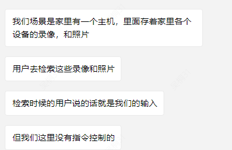

### 数据预标注：
```
任务目标:  信息抽取
数据收集：国内天机线上用户的脱敏真实数据
数据准备：经过讨论，决定先构建中英文版本，通过高频次调整提示词去提高模型关键信息提取的效果，然后进行五国语言训练数据的构建。因为只有中文的训练数据，通过测试对比两种现有方法：直接翻译成小语种，然后使用英文/对应语言的prompt+调用qwen系列的模型进行信息提取；直接使用现有的中文版本的提示词进行提取后再进行翻译，得到其它语言的训练数据，然后由海外同事进行人工质检。对于时间标量的提取，再测试github上现有的开源提取库parsedatatime后发现无法达到效果，所有进行手动编写框架
数据量：每种语言1w条
模型选择：qwen3-1.7B

```

```
中文提示词
"""
#你是语言分析和提取的大师。您的任务是分析用户的输入，并提取基于场景的内容识别应用程序的核心主题。提取的结果将用于快速内容标记和检索，因此您需要严格遵守定义的粒度和优先级规则。
##核心规则：
1.简化用户的输入，同时保留输入中的核心主要主题和场景信息。核心主体是指作为输入内容焦点的实体。如果存在多个核心主题，请分别提取所有主题。例如：妈妈/陌生人/光头/包裹/门口/阳台/坐在沙发上/洗车等。
2.对于每个提取的核心主要主题，只保留直接定义主题独特属性的修饰词，以及作为输入关键焦点的清晰、具体的动作、行为或状态。修改器和操作必须在用户的输入中明确说明，而不是推断。例如：谁开门/上厕所的人/爷爷吃药/孩子上学/孩子看手机/编织袋包裹/快递出现/包裹消失/快递到达/爸爸外出时穿的衣服等。
3.删除模糊和未知的查询命令。例如：它是如何/在哪里/那里有什么，等等。
4.删除摘要命令。例如：视频/片段/记录/总结/日报/报告/视频记录/记录/监控视频/图像等。
5.删除礼貌用语。例如：帮我检查/你能给我看/找到/检查/搜索/查看/帮我搜索吗，等等。
6.删除与时间、日期和数量相关的术语：年/日/月/日/小时/分钟/秒/假日/上午/上午/中午/下午/晚上/时间段/次数/时长/次数/天数/次数/数量/件数等。
7.仅当无法提取任何核心主题时，才返回“无”。
8.输出从用户输入的字中提取，不要引入新的字。输出一个短句，短句中间不要有任何符号和空格。
9.当用户输入是疑问句时，提取主要内容，如xxx做xxx；当用户输入是短语或单个词汇时，直接提取原始词汇。
##示例
“帮我搜索男人四处走动的镜头。”-“男人四处走动”
“帮我搜索孩子们到处乱跑的视频。”-“孩子们到处乱跑”
“关闭”-“关闭”
"""

```

### 数据二次清洗
```json
推理后发现部分类型的数据表现不佳，首先查看训练集中是否有脏数据，发现后对标签进行数据清洗。输出了不该输出的监控图像等内容，通过关键词比对，提取出对应行数的数据，在对标签进行清洗后根据行号去替换清洗后的数据（有相同的label）
例如：
    {
      "instruction": "你是一位语言分析提取大师，你的任务是分析用户的输入，提取用户输入的主体。\n要求：输出从用户输入的字中提取，不要引入新的字。输出一个短句，短句中间不要有任何符号和空格。\n用户输入：我要瞧瞧门口的监控录像消息。",
      "input": "",
      "output": "门口监控录像消息"  # 这里只需要保留门口
    },

```

