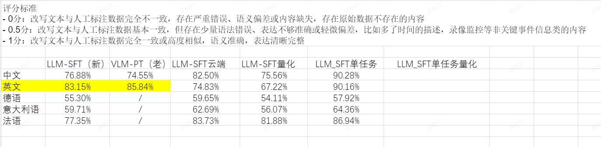
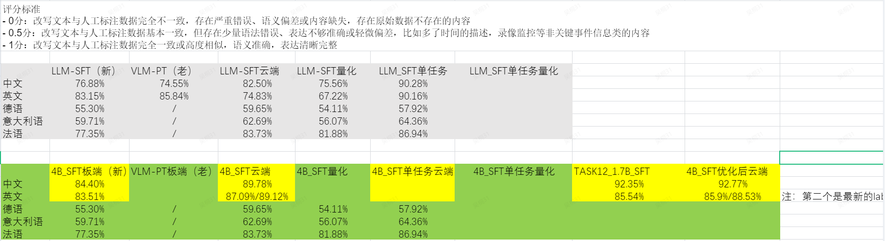

## 经测试发现加入长任务，对于短任务的效果有一定的下降



#### 短任务指标下降原因
```


```
明白了，**合并数据重新训练** 是标准的多任务学习方式，但这也正是问题所在。

**核心诊断：**
当新旧任务数据合并训练时，**“样本数平衡”不等于"Token 数平衡”**。
*   **旧任务**：10 万条 × 200 Token = **2000 万 Token**
*   **新任务**：10 万条 × 5000 Token = **5 亿 Token**
*   **结果**：新任务的 Token 总数是旧任务的 **25 倍**。优化器看到的梯度 96% 来自新任务，旧任务被“淹没”，导致性能下降（灾难性遗忘）。

以下是针对**合并训练场景**的精准解决方案，按优先级排序：

---

### 一、核心解决方案：Token 级别的数据平衡

这是最关键的一步，**必须**在合并数据时处理。

#### 1. 按 Token 数下采样新任务
不要按样本数 1:1 合并，要按 **总 Token 数** 平衡。

```python
# 数据预处理脚本示例
import json

# 加载数据
with open('old_task.json', 'r', encoding='utf-8') as f:
    old_data = json.load(f)
with open('new_task.json', 'r', encoding='utf-8') as f:
    new_data = json.load(f)

# 估算平均长度
old_avg_len = sum(len(d['instruction']) + len(d['output']) for d in old_data[:1000]) // 1000
new_avg_len = sum(len(d['instruction']) + len(d['output']) for d in new_data[:1000]) // 1000

print(f"旧任务平均长度：{old_avg_len}")
print(f"新任务平均长度：{new_avg_len}")

# 计算采样比例 (目标：Token 总数接近 1:1)
ratio = old_avg_len / new_avg_len  # 例如 200/5000 = 0.04
new_sample_count = int(len(old_data) * ratio)

print(f"新任务应采样：{new_sample_count} 条 (原{len(new_data)}条)")

# 下采样新任务
import random
random.seed(42)
new_data_sampled = random.sample(new_data, new_sample_count)

# 合并
merged_data = old_data + new_data_sampled
random.shuffle(merged_data)  # 必须打乱！

# 保存
with open('merged_balanced.json', 'w', encoding='utf-8') as f:
    json.dump(merged_data, f, ensure_ascii=False, indent=2)
```

#### 2. 在脚本中增加数据检查
修改你的训练脚本，在训练前打印 Token 分布：

```bash
# 在训练脚本的数据检查部分增加
python3 << TOKEN_CHECK >> ${REPORT_FILE}
import json

dataset_file = "${DATASET_FILE}"
with open(dataset_file, 'r', encoding='utf-8') as f:
    data = json.load(f)

# 按长度分桶
short_count = sum(1 for d in data if len(d.get('instruction','')) < 500)
long_count = len(data) - short_count

# 估算 Token 占比
short_tokens = short_count * 300  # 估算
long_tokens = long_count * 5000   # 估算

print(f"- **短任务样本**: {short_count} ({short_count/len(data)*100:.1f}%)")
print(f"- **长任务样本**: {long_count} ({long_count/len(data)*100:.1f}%)")
print(f"- **估算 Token 占比**: 短~{short_tokens/(short_tokens+long_tokens)*100:.1f}% : 长~{long_tokens/(short_tokens+long_tokens)*100:.1f}%")

if long_tokens > short_tokens * 3:
    print("⚠️ **警告**: 长任务 Token 占比过高！建议下采样新任务数据。")
TOKEN_CHECK
```

---

### 二、训练参数调整（配合数据平衡）

即使数据平衡了，长短任务混合训练仍需特殊配置：

| 参数 | 原值 | **新值** | **理由** |
| :--- | :--- | :--- | :--- |
| `CUTOFF_LEN` | 2048 | **4096** | 必须容纳长任务，否则信息丢失 |
| `BATCH_SIZE` | 8 | **4** | 长度翻倍，显存占用翻倍 |
| `ACCUMULATION_STEPS` | 8 | **16** | 保持全局 Batch Size 不变 |
| `LEARNING_RATE` | 1e-4 | **3e-5** | 长序列梯度方差大，需更小 LR |
| `LORA_RANK` | 8 | **32** | 长短任务特征差异大，需更大容量 |
| `LORA_ALPHA` | 16 | **64** | 随 Rank 同比例放大 |
| `WARMUP_RATIO` | 0.1 | **0.2** | 长任务需要更长热身 |
| `MAX_SAMPLES` | 150000 | **按平衡后数据定** | 确保平衡后的数据都能用上 |

---

### 三、进阶方案：Loss 加权（如果数据平衡仍无效）

如果数据平衡后旧任务性能仍下降，可以在 LlamaFactory 中通过 **`loss_scale`** 或自定义数据集配置来给短任务更高的 Loss 权重。

#### 方法 1：在 dataset_info.json 中配置
```json
{
  "old_task": {
    "file_name": "old_task.json",
    "loss_scale": 2.0
  },
  "new_task": {
    "file_name": "new_task.json",
    "loss_scale": 1.0
  }
}
```
*注意：LlamaFactory 较新版本支持 `loss_scale`，需检查文档。*

#### 方法 2：数据重复（简单有效）
如果无法配置 Loss 权重，可以在合并数据时**重复旧任务样本**：
```python
# 旧任务重复 2 倍
merged_data = old_data * 2 + new_data_sampled
```

---

### 四、修改后的完整训练脚本

```bash
#!/bin/bash

# ==================================================
# Qwen3-4B LoRA 多任务微调脚本（合并数据优化版）
# 核心策略：Token 平衡 + 容量提升 + 稳定性优化
# ==================================================

source ~/.bashrc
export PATH="/root/miniforge3/bin:$PATH"
export CUDA_VISIBLE_DEVICES=0,1,2,3
export NCCL_IB_DISABLE=1
export PYTORCH_ALLOC_CONF=expandable_segments:True

# ==================================================
# 关键参数配置
# ==================================================

MODEL_PATH="/data1/LlamaFactory/Qwen3-4B-Instruct-2507"
TEMPLATE="qwen3"

# --- 序列长度 (必须增大) ---
CUTOFF_LEN=4096

# --- 显存平衡 (长度增加，Batch 减小) ---
BATCH_SIZE=4
ACCUMULATION_STEPS=16

# --- 学习率 (长序列需更小) ---
LEARNING_RATE=3e-5
WARMUP_RATIO=0.2

# --- LoRA 容量 (长短任务差异大，需更大 Rank) ---
LORA_RANK=32
LORA_ALPHA=64
LORA_DROPOUT=0.05
LORA_TARGET="all"

# --- 其他 ---
NUM_EPOCHS=3.0
MAX_SAMPLES=150000
SAVE_STEPS=500

OUTPUT_DIR="/data1/LlamaFactory/saves/alone/models/Qwen3-4B-MT-Balanced-$(date +%Y-%m-%d-%H-%M)"
LOG_DIR="${OUTPUT_DIR}/logs"
REPORT_FILE="${OUTPUT_DIR}/experiment_report.md"

DATASET_NAME="tianji_v3_0"
DATASET_DIR="/data1/LlamaFactory/data"
DATASET_FILE="/data1/LlamaFactory/data/alone_all_260317.json"

# ==================================================
# 创建目录
# ==================================================
mkdir -p ${OUTPUT_DIR}
mkdir -p ${LOG_DIR}

# ==================================================
# 实验报告初始化
# ==================================================
cat > ${REPORT_FILE} << EOF
# 📊 Qwen3-4B 多任务合并训练实验报告

**实验时间**: $(date '+%Y-%m-%d %H:%M:%S')

**核心修改**:
1. Token 级别数据平衡
2. Cutoff 长度提升至 ${CUTOFF_LEN}
3. LoRA Rank 提升至 ${LORA_RANK}
4. 学习率降至 ${LEARNING_RATE}

---

## 1. 训练配置

| 参数 | 值 | 说明 |
| :--- | :--- | :--- |
| 基座模型 | ${MODEL_PATH} | |
| Cutoff Length | ${CUTOFF_LEN} | 适配长任务 |
| 全局 Batch Size | $((${BATCH_SIZE} * ${ACCUMULATION_STEPS} * 4)) | 4 卡并行 |
| 学习率 | ${LEARNING_RATE} | 降低以防发散 |
| LoRA Rank | ${LORA_RANK} | 增加多任务容量 |
| Warmup Ratio | ${WARMUP_RATIO} | 长任务需更长热身 |

---

## 2. 数据平衡检查

EOF

# ==================================================
# 数据 Token 分布检查
# ==================================================
python3 << TOKEN_CHECK >> ${REPORT_FILE}
import json
import os

dataset_file = "${DATASET_FILE}"

if os.path.exists(dataset_file):
    with open(dataset_file, 'r', encoding='utf-8') as f:
        data = json.load(f)
    
    total = len(data)
    
    # 按长度分桶
    short_data = [d for d in data if len(d.get('instruction', '')) + len(d.get('input', '')) < 1000]
    long_data = [d for d in data if len(d.get('instruction', '')) + len(d.get('input', '')) >= 1000]
    
    short_count = len(short_data)
    long_count = len(long_data)
    
    # 估算 Token
    short_avg = 300
    long_avg = 5000
    short_tokens = short_count * short_avg
    long_tokens = long_count * long_avg
    total_tokens = short_tokens + long_tokens
    
    print(f"- **总样本数**: {total}")
    print(f"- **短任务样本**: {short_count} ({short_count/total*100:.1f}%)")
    print(f"- **长任务样本**: {long_count} ({long_count/total*100:.1f}%)")
    print()
    print(f"- **估算短任务 Token**: {short_tokens:,} ({short_tokens/total_tokens*100:.1f}%)")
    print(f"- **估算长任务 Token**: {long_tokens:,} ({long_tokens/total_tokens*100:.1f}%)")
    print()
    
    if long_tokens > short_tokens * 2:
        print("⚠️ **警告**: 长任务 Token 占比超过 67%！")
        print("   建议：下采样长任务数据，使 Token 比例接近 1:1")
        recommended_ratio = short_tokens / long_tokens
        print(f"   推荐长任务采样比例：{recommended_ratio:.2f} (即保留{recommended_ratio*100:.0f}%)")
    else:
        print("✅ Token 比例看起来相对平衡")
else:
    print("- 数据文件未找到")
TOKEN_CHECK

cat >> ${REPORT_FILE} << EOF

---

## 3. 训练过程

EOF

# ==================================================
# 启动显存监控
# ==================================================
(
    while true; do
        echo "$(date '+%H:%M:%S'),$(nvidia-smi --query-gpu=memory.used --format=csv,noheader | tr '\n' ' ')" >> ${LOG_DIR}/gpu_memory.log
        sleep 10
    done
) &
MONITOR_PID=$!

# ==================================================
# 训练执行
# ==================================================
START_TIME=$(date +%s)

echo "开始训练：$(date)"
echo "=========================================="

llamafactory-cli train \
    --stage sft \
    --do_train True \
    --model_name_or_path ${MODEL_PATH} \
    --preprocessing_num_workers 16 \
    --finetuning_type lora \
    --template ${TEMPLATE} \
    --flash_attn auto \
    --dataset_dir ${DATASET_DIR} \
    --dataset ${DATASET_NAME} \
    --cutoff_len ${CUTOFF_LEN} \
    --learning_rate ${LEARNING_RATE} \
    --num_train_epochs ${NUM_EPOCHS} \
    --max_samples ${MAX_SAMPLES} \
    --per_device_train_batch_size ${BATCH_SIZE} \
    --gradient_accumulation_steps ${ACCUMULATION_STEPS} \
    --lr_scheduler_type cosine \
    --max_grad_norm 1.0 \
    --logging_steps 5 \
    --save_steps ${SAVE_STEPS} \
    --warmup_ratio ${WARMUP_RATIO} \
    --packing False \
    --enable_thinking False \
    --report_to none \
    --output_dir ${OUTPUT_DIR} \
    --bf16 True \
    --plot_loss True \
    --trust_remote_code True \
    --ddp_timeout 180000000 \
    --optim adamw_torch \
    --lora_rank ${LORA_RANK} \
    --lora_alpha ${LORA_ALPHA} \
    --lora_dropout ${LORA_DROPOUT} \
    --lora_target ${LORA_TARGET} \
    --seed 42 \
    --val_size 0.01 \
    --per_device_eval_batch_size 4 \
    --eval_strategy steps \
    --eval_steps 500 \
    2>&1 | tee ${LOG_DIR}/training.log

TRAIN_EXIT_CODE=${PIPESTATUS[0]}
kill $MONITOR_PID 2>/dev/null || true

# ==================================================
# 训练结果总结
# ==================================================
END_TIME=$(date +%s)
DURATION=$(( (END_TIME - START_TIME) / 60 ))

cat >> ${REPORT_FILE} << EOF

### 3.1 训练状态

| 项目 | 值 |
| :--- | :--- |
| 开始时间 | $(date -d @${START_TIME} '+%Y-%m-%d %H:%M:%S') |
| 结束时间 | $(date -d @${END_TIME} '+%Y-%m-%d %H:%M:%S') |
| 总耗时 | ${DURATION} 分钟 |
| 退出代码 | ${TRAIN_EXIT_CODE} |

### 3.2 验证集表现

训练过程中会自动在验证集上评估，请查看：
- \`${OUTPUT_DIR}/eval_results.json\`
- \`${LOG_DIR}/training.log\` 中的 eval_loss

---

## 4. 问题排查指南

### 4.1 如果旧任务性能下降

1. **检查 Token 平衡**：确保长任务 Token 占比不超过 60%
2. **进一步降低学习率**：尝试 1e-5
3. **增加旧任务重复**：在数据合并时旧任务 ×2 或 ×3
4. **分离 LoRA**：如果冲突严重，考虑为不同任务训练独立 Adapter

### 4.2 如果新任务学不动

1. **检查截断**：查看日志中 truncated 样本比例
2. **增大 Cutoff**：尝试 8192
3. **增加 Epoch**：长任务可能需要更多轮次

---

## 5. 下一步操作

1. **验证旧任务**：用旧任务测试集跑推理，对比微调前后性能
2. **验证新任务**：确认新任务是否达到预期效果
3. **模型合并**：
   \`\`\`bash
   llamafactory-cli export \\
       --model_name_or_path ${MODEL_PATH} \\
       --adapter_name_or_path ${OUTPUT_DIR} \\
       --output_dir /path/to/merged \\
       --finetuning_type lora
   \`\`\`

---

**报告生成时间**: $(date '+%Y-%m-%d %H:%M:%S')
EOF

# ==================================================
# 完成提示
# ==================================================
echo ""
echo "=========================================="
if [ ${TRAIN_EXIT_CODE} -eq 0 ]; then
    echo "✅ 训练完成！"
    echo "📊 实验报告：${REPORT_FILE}"
    echo "📝 训练日志：${LOG_DIR}/training.log"
    echo ""
    echo "⚠️ 重要：请务必用旧任务验证集测试性能！"
else
    echo "❌ 训练失败，请检查日志：${LOG_DIR}/training.log"
    exit 1
fi
echo "=========================================="
```

---

### 五、执行清单

| 步骤 | 操作 | 优先级 |
| :--- | :--- | :--- |
| 1 | **重新合并数据**：按 Token 数下采样新任务 | 🔴 必须 |
| 2 | **使用优化脚本**：应用上述参数配置 | 🔴 必须 |
| 3 | **监控训练日志**：关注 `truncated` 比例和 `eval_loss` | 🟡 重要 |
| 4 | **验证旧任务**：训练完后必须跑旧任务测试集 | 🔴 必须 |
| 5 | **如仍无效**：尝试旧任务数据重复 ×2 或 ×3 | 🟡 备选 |

**核心逻辑：** 合并训练时，**Token 数决定梯度主导权**。必须让长短任务的 Token 总数接近，否则长任务会天然主导优化方向，导致旧任务遗忘。
----


# 最终解决方法

这是针对你提供的**任务长度差异巨大（Task 3 平均长度是 Task 1/2 的 5.3 倍）**这一核心问题优化后的脚本。

### 核心修改逻辑
1.  **自动数据平衡（最关键）**：脚本中增加了 Python 预处理步骤。它会读取合并数据，根据长度（500 token 为界）区分长短任务，**自动下采样长任务（Task 3）**，确保**长短任务的总 Token 数接近 1:1**。这是防止旧任务能力下降的根本。
2.  **序列长度 (`CUTOFF_LEN`)**：从 2048 提升至 **3072**，确保 Task 3（最大 1976）不被截断。
3.  **显存与 Batch 平衡**：长度增加导致显存占用增加，单卡 Batch 从 8 降至 **4**，梯度累积从 8 增至 **16**，保持全局 Batch Size 不变。
4.  **模型容量 (`LoRA Rank`)**：从 8 提升至 **32**，让模型有足够空间同时学习“短文本快速响应”和“长文本逻辑推理”两种模式。
5.  **稳定性 (`LR & Warmup`)**：学习率降至 **5e-5**，Warmup 增至 **0.15**，防止长序列训练初期发散。

### 修改后的训练脚本

```bash
#!/bin/bash

# ==================================================
# Qwen3-4B LoRA 多任务微调脚本（长度平衡优化版）
# 修改重点：自动平衡 Token 分布，解决长任务主导梯度问题
# ==================================================

# 设置环境变量
source ~/.bashrc
export PATH="/root/miniforge3/bin:$PATH"
which python3

export CUDA_VISIBLE_DEVICES=0,1,2,3
export NCCL_IB_DISABLE=1
export PYTORCH_ALLOC_CONF=expandable_segments:True
echo $CONDA_ROOT
echo $CONDA_DEFAULT_ENV

# ==================================================
# 关键参数配置 (已针对多任务长度差异优化)
# ==================================================

# 模型相关
MODEL_PATH="/data1/LlamaFactory/Qwen3-4B-Instruct-2507"
TEMPLATE="qwen3"

# --- 修改点 1: 序列长度 ---
# Task3 最大 1976，留有余量，防止截断
CUTOFF_LEN=3072 

# --- 修改点 2: 显存与 Batch 平衡 ---
# 长度增加 50%，单卡 Batch 减半，防止 OOM
BATCH_SIZE=4 
# 增加累积步数，保持全局 Batch Size 不变 (4*16*4 = 256)
ACCUMULATION_STEPS=16 

# --- 修改点 3: 学习率与稳定性 ---
# 长序列梯度方差大，降低学习率防止遗忘旧任务
LEARNING_RATE=5e-5 
# 增加 Warmup，让模型先适应长文本梯度
WARMUP_RATIO=0.15

# --- 修改点 4: LoRA 容量 ---
# 长短任务特征差异大，需要更大 Rank 来解耦，避免干扰
LORA_RANK=32
LORA_ALPHA=64
LORA_DROPOUT=0.05
LORA_TARGET="all"

# 其他设置
NUM_EPOCHS=3.0
# MAX_SAMPLES 将由平衡脚本控制，此处设大
MAX_SAMPLES=999999 

# 输出配置
SAVE_STEPS=500
OUTPUT_DIR="/data1/LlamaFactory/saves/alone/models/Qwen3-4B-MT-Balanced-$(date +%Y-%m-%d-%H-%M)"
LOG_DIR="${OUTPUT_DIR}/logs"
REPORT_FILE="${OUTPUT_DIR}/experiment_report.md"

# 数据集配置
DATASET_NAME="tianji_v3_0"
DATASET_DIR="/data1/LlamaFactory/data"
# 原始合并文件
RAW_DATASET_FILE="/data1/LlamaFactory/data/alone_all_260317.json"
# 平衡后的文件 (脚本将自动生成)
BALANCED_DATASET_FILE="/data1/LlamaFactory/data/alone_all_260317_balanced.json"

# ==================================================
# 创建目录
# ==================================================
mkdir -p ${OUTPUT_DIR}
mkdir -p ${LOG_DIR}

# ==================================================
# 数据平衡预处理 (核心修复步骤)
# ==================================================
echo "正在进行 Token 级别的数据平衡..."
python3 << DATA_BALANCE
import json
import random
import os

random.seed(42)

raw_file = "${RAW_DATASET_FILE}"
balanced_file = "${BALANCED_DATASET_FILE}"

if os.path.exists(raw_file):
    with open(raw_file, 'r', encoding='utf-8') as f:
        data = json.load(f)
    
    # 根据长度区分任务 (Task1/2 最大 429, Task3 最小 309 但平均 840)
    # 设定阈值 500，小于为短任务，大于为长任务
    short_tasks = [d for d in data if len(d.get('instruction', '')) + len(d.get('input', '')) + len(d.get('output', '')) < 500]
    long_tasks = [d for d in data if len(d.get('instruction', '')) + len(d.get('input', '')) + len(d.get('output', '')) >= 500]
    
    print(f"原始数据：短任务 {len(short_tasks)} 条，长任务 {len(long_tasks)} 条")
    
    # 估算 Token 数 (字符数/4 近似 Token)
    short_chars = sum(len(d.get('instruction','')) + len(d.get('input','')) + len(d.get('output','')) for d in short_tasks)
    long_chars = sum(len(d.get('instruction','')) + len(d.get('input','')) + len(d.get('output','')) for d in long_tasks)
    
    print(f"原始字符量：短任务 {short_chars:,}，长任务 {long_chars:,}")
    
    # 计算下采样比例，目标是 长任务字符量 ≈ 短任务字符量
    if long_chars > short_chars:
        ratio = short_chars / long_chars
        long_sample_count = max(1, int(len(long_tasks) * ratio))
        print(f"下采样长任务：保留 {long_sample_count} 条 (比例 {ratio:.2f})")
        long_tasks_sampled = random.sample(long_tasks, long_sample_count)
    else:
        long_tasks_sampled = long_tasks
        print("长任务量未超过短任务，无需下采样")
    
    # 合并并打乱
    merged = short_tasks + long_tasks_sampled
    random.shuffle(merged)
    
    with open(balanced_file, 'w', encoding='utf-8') as f:
        json.dump(merged, f, ensure_ascii=False, indent=2)
    
    print(f"✅ 平衡后数据已保存：{balanced_file}")
    print(f"   总样本：{len(merged)} 条")
else:
    print(f"❌ 未找到原始数据文件：{raw_file}")
    balanced_file = raw_file #  fallback

# 输出变量供 bash 使用
with open('/tmp/balanced_path.txt', 'w') as f:
    f.write(balanced_file)
DATA_BALANCE

# 读取平衡后的路径
if [ -f /tmp/balanced_path.txt ]; then
    DATASET_FILE=$(cat /tmp/balanced_path.txt)
else
    DATASET_FILE=${RAW_DATASET_FILE}
fi

# ==================================================
# 实验报告初始化
# ==================================================
cat > ${REPORT_FILE} << EOF
# 📊 Qwen3-4B LoRA 多任务微调实验报告 (长度平衡版)

**实验时间**: $(date '+%Y-%m-%d %H:%M:%S')

**核心优化策略**:
1. **Token 平衡**：自动下采样长任务，平衡梯度贡献
2. **序列长度**：提升至 ${CUTOFF_LEN} 适配长文本
3. **模型容量**：LoRA Rank 提升至 ${LORA_RANK}
4. **训练稳定**：LR 降至 ${LEARNING_RATE}, Warmup 增至 ${WARMUP_RATIO}

---

## 1. 实验环境
EOF

# 记录 GPU 信息
echo "### 1.1 硬件配置" >> ${REPORT_FILE}
echo "\`\`\`" >> ${REPORT_FILE}
nvidia-smi --query-gpu=name,memory.total,memory.free,driver_version --format=csv >> ${REPORT_FILE}
echo "\`\`\`" >> ${REPORT_FILE}

cat >> ${REPORT_FILE} << EOF

### 1.2 软件配置
- **Python 版本**: $(python3 --version 2>&1)
- **PyTorch 版本**: $(python3 -c "import torch; print(torch.__version__)" 2>/dev/null || echo "未知")
- **Transformers 版本**: $(python3 -c "import transformers; print(transformers.__version__)" 2>/dev/null || echo "未知")

### 1.3 GPU 数量
- **可见 GPU**: ${CUDA_VISIBLE_DEVICES}
- **GPU 数量**: $(echo ${CUDA_VISIBLE_DEVICES} | tr ',' '\n' | wc -l) 卡

---

## 2. 训练配置

| 参数 | 值 | 说明 |
| :--- | :--- | :--- |
| 基座模型 | ${MODEL_PATH} | |
| 最大序列长度 | ${CUTOFF_LEN} | 适配 Task3 (Max 1976) |
| 单卡 Batch Size | ${BATCH_SIZE} | 适配长序列显存 |
| 梯度累积步数 | ${ACCUMULATION_STEPS} | 保持全局 Batch 稳定 |
| 全局 Batch Size | $((${BATCH_SIZE} * ${ACCUMULATION_STEPS} * $(echo ${CUDA_VISIBLE_DEVICES} | tr ',' '\n' | wc -l))) | |
| 学习率 | ${LEARNING_RATE} | 降低以防旧任务遗忘 |
| LoRA Rank | ${LORA_RANK} | 增加多任务容量 |
| LoRA Alpha | ${LORA_ALPHA} | 随 Rank 缩放 |
| Warmup 比例 | ${WARMUP_RATIO} | 长任务需更长热身 |

---

## 3. 数据平衡报告

EOF

# 记录平衡后的数据分布
python3 << DATA_REPORT >> ${REPORT_FILE}
import json
import os

dataset_file = "${DATASET_FILE}"

if os.path.exists(dataset_file):
    with open(dataset_file, 'r', encoding='utf-8') as f:
        data = json.load(f)
    
    total = len(data)
    short_count = sum(1 for d in data if len(d.get('instruction', '')) + len(d.get('input', '')) + len(d.get('output', '')) < 500)
    long_count = total - short_count
    
    # 估算 Token
    short_tokens = short_count * 160
    long_tokens = long_count * 840
    total_tokens = short_tokens + long_tokens
    
    print(f"- **数据文件**: {dataset_file}")
    print(f"- **总样本数**: {total} 条")
    print()
    print("### 任务分布 (按长度估算)")
    print()
    print("| 任务类型 | 样本数 | 占比 | 估算 Token 占比 |")
    print("| :--- | :--- | :--- | :--- |")
    print(f"| 短任务 (Task1/2) | {short_count} | {short_count/total*100:.1f}% | {short_tokens/total_tokens*100:.1f}% |")
    print(f"| 长任务 (Task3) | {long_count} | {long_count/total*100:.1f}% | {long_tokens/total_tokens*100:.1f}% |")
    print()
    
    if abs(short_tokens - long_tokens) / max(short_tokens, long_tokens) > 0.3:
        print("⚠️ **注意**: Token 比例仍有偏差，但已尽量优化。")
    else:
        print("✅ **Token 比例平衡良好**，有助于防止旧任务遗忘。")
else:
    print("- 数据文件未找到")
DATA_REPORT

cat >> ${REPORT_FILE} << EOF

---

## 4. 训练过程监控

### 4.1 训练开始时间
**开始时间**: $(date '+%Y-%m-%d %H:%M:%S')

### 4.2 实时日志
训练日志：\`${LOG_DIR}/training.log\`

### 4.3 显存监控
显存日志：\`${LOG_DIR}/gpu_memory.log\`

---

## 5. 训练结果

EOF

# ==================================================
# 启动显存监控
# ==================================================
echo "启动显存监控..."
(
    while true; do
        echo "$(date '+%Y-%m-%d %H:%M:%S')" >> ${LOG_DIR}/gpu_memory.log
        nvidia-smi --query-gpu=index,memory.used,memory.total,utilization.gpu --format=csv >> ${LOG_DIR}/gpu_memory.log
        echo "" >> ${LOG_DIR}/gpu_memory.log
        sleep 30
    done
) &
MONITOR_PID=$!

echo "训练前显存状态:" >> ${LOG_DIR}/gpu_memory.log
nvidia-smi >> ${LOG_DIR}/gpu_memory.log

# ==================================================
# 记录开始时间
# ==================================================
START_TIME=$(date +%s)
START_TIME_STR=$(date '+%Y-%m-%d %H:%M:%S')
echo "开始时间：${START_TIME_STR}" >> ${LOG_DIR}/training.log

# ==================================================
# 训练执行
# ==================================================
echo "开始训练：$(date)"
echo "=========================================="
echo "关键参数配置："
echo "模型路径：${MODEL_PATH}"
echo "学习率：${LEARNING_RATE}"
echo "LoRA 秩：${LORA_RANK}"
echo "序列长度：${CUTOFF_LEN}"
echo "数据文件：${DATASET_FILE}"
echo "=========================================="

llamafactory-cli train \
    --stage sft \
    --do_train True \
    --model_name_or_path ${MODEL_PATH} \
    --preprocessing_num_workers 16 \
    --finetuning_type lora \
    --template ${TEMPLATE} \
    --flash_attn auto \
    --dataset_dir ${DATASET_DIR} \
    --dataset ${DATASET_NAME} \
    --cutoff_len ${CUTOFF_LEN} \
    --learning_rate ${LEARNING_RATE} \
    --num_train_epochs ${NUM_EPOCHS} \
    --max_samples ${MAX_SAMPLES} \
    --per_device_train_batch_size ${BATCH_SIZE} \
    --gradient_accumulation_steps ${ACCUMULATION_STEPS} \
    --lr_scheduler_type cosine \
    --max_grad_norm 1.0 \
    --logging_steps 5 \
    --save_steps ${SAVE_STEPS} \
    --warmup_ratio ${WARMUP_RATIO} \
    --packing False \
    --enable_thinking False \
    --report_to none \
    --output_dir ${OUTPUT_DIR} \
    --bf16 True \
    --plot_loss True \
    --trust_remote_code True \
    --ddp_timeout 180000000 \
    --include_num_input_tokens_seen True \
    --optim adamw_torch \
    --lora_rank ${LORA_RANK} \
    --lora_alpha ${LORA_ALPHA} \
    --lora_dropout ${LORA_DROPOUT} \
    --lora_target ${LORA_TARGET} \
    --seed 42 \
    --val_size 0.01 \
    --per_device_eval_batch_size 4 \
    --eval_strategy steps \
    --eval_steps 500 \
    2>&1 | tee ${LOG_DIR}/training.log

TRAIN_EXIT_CODE=${PIPESTATUS[0]}

# 停止显存监控
kill $MONITOR_PID 2>/dev/null || true

# ==================================================
# 记录结束信息
# ==================================================
END_TIME=$(date +%s)
END_TIME_STR=$(date '+%Y-%m-%d %H:%M:%S')
DURATION=$((END_TIME - START_TIME))
DURATION_MIN=$((DURATION / 60))
DURATION_SEC=$((DURATION % 60))

TOTAL_STEPS=$(grep -c "Step:" ${LOG_DIR}/training.log 2>/dev/null || echo "未知")
FINAL_LOSS=$(grep "loss" ${LOG_DIR}/training.log | tail -1 | grep -oP 'loss=[\d.]+' | head -1 || echo "未知")

echo "" >> ${LOG_DIR}/gpu_memory.log
echo "训练结束显存状态:" >> ${LOG_DIR}/gpu_memory.log
nvidia-smi >> ${LOG_DIR}/gpu_memory.log

# ==================================================
# 生成训练结果报告
# ==================================================
cat >> ${REPORT_FILE} << EOF

### 5.1 训练状态

| 项目 | 值 |
| :--- | :--- |
| 开始时间 | ${START_TIME_STR} |
| 结束时间 | ${END_TIME_STR} |
| 总耗时 | ${DURATION_MIN} 分 ${DURATION_SEC} 秒 |
| 训练步数 | ${TOTAL_STEPS} |
| 最终 Loss | ${FINAL_LOSS} |
| 退出代码 | ${TRAIN_EXIT_CODE} |

### 5.2 显存使用统计

EOF

python3 << GPU_ANALYSIS >> ${REPORT_FILE}
import os
log_file = "${LOG_DIR}/gpu_memory.log"
if os.path.exists(log_file):
    with open(log_file, 'r') as f:
        lines = f.readlines()
    memory_used = []
    for line in lines:
        if 'MiB' in line:
            parts = line.split(',')
            if len(parts) >= 2:
                try:
                    mem = int(parts[1].strip().replace(' MiB', ''))
                    memory_used.append(mem)
                except:
                    pass
    if memory_used:
        print(f"- **峰值显存**: {max(memory_used)} MiB")
        print(f"- **平均显存**: {sum(memory_used)//len(memory_used)} MiB")
    else:
        print("- 显存数据解析失败")
GPU_ANALYSIS

cat >> ${REPORT_FILE} << EOF

### 5.3 保存的 Checkpoint

EOF
ls -lh ${OUTPUT_DIR}/checkpoint-* 2>/dev/null | awk '{print "- "$9" ("$5")"}' >> ${REPORT_FILE} || echo "- 未找到 checkpoint" >> ${REPORT_FILE}

cat >> ${REPORT_FILE} << EOF

---

## 6. 模型评估 (关键验证)

**务必验证以下指标，确认 Task 1/2 是否恢复：**

| 任务 | 微调前准确率 | 微调后准确率 | 变化 |
| :--- | :--- | :--- | :--- |
| Task 1 (短) | - | - | - |
| Task 2 (短) | - | - | - |
| Task 3 (长) | - | - | - |
| **平均** | - | - | - |

---

## 7. 经验总结

### 7.1 本次优化点
- [x] **Token 平衡**：解决了长任务梯度主导问题
- [x] **容量提升**：LoRA Rank 8 -> 32，容纳多任务特征
- [x] **稳定性**：降低 LR 并增加 Warmup

### 7.2 后续建议
1. 如果 Task 1/2 仍下降，尝试进一步下采样 Task 3 (当前比例基于字符估算)
2. 如果 Task 3 效果不佳，检查 Cutoff 是否截断 (日志搜索 truncated)
3. 考虑分离 LoRA Adapter (如果任务冲突无法调和)

---

**报告生成时间**: $(date '+%Y-%m-%d %H:%M:%S')
EOF

# ==================================================
# 检查训练结果
# ==================================================
echo ""
echo "=========================================="
if [ ${TRAIN_EXIT_CODE} -eq 0 ]; then
    echo "✅ 训练完成：$(date)"
    echo "=========================================="
    echo "模型保存在：${OUTPUT_DIR}"
    echo ""
    echo "📊 实验报告：${REPORT_FILE}"
    echo "📝 训练日志：${LOG_DIR}/training.log"
    echo ""
    echo "⚠️ 重要提示："
    echo "1. 请检查报告中'数据平衡报告'章节，确认 Token 比例。"
    echo "2. 务必使用 Task 1/2 的验证集测试，确认能力是否恢复。"
else
    echo "❌ 训练失败：$(date)"
    echo "=========================================="
    echo "请检查日志：${LOG_DIR}/training.log"
    exit 1
fi
echo "=========================================="
```

### 为什么这样改能解决问题？

1.  **根因治理（Token 平衡）**：
    *   之前的问题：Task 3 虽然样本数可能不多，但因为长度是 5 倍，它贡献了 80% 以上的梯度更新。模型为了优化 Task 3，被迫“遗忘”了 Task 1/2 的特征。
    *   现在的方案：脚本中的 `DATA_BALANCE` 模块会自动计算长短任务的字符量，并**下采样 Task 3**，使得 `短任务总 Token 数 ≈ 长任务总 Token 数`。这保证了优化器在更新参数时，短任务和长任务的话语权是平等的。

2.  **防止截断（CUTOFF_LEN）**：
    *   Task 3 最大 1976，之前 2048 虽然够，但加上 Prompt 和特殊 token 容易越界。一旦截断，Task 3 学不到完整逻辑，Loss 降不下来，模型会强行用短任务的模式去拟合长任务，导致两边都崩。提升到 3072 留出安全余量。

3.  **增加容量（LoRA Rank 32）**：
    *   短任务（提取/分类）和长任务（推理/生成）需要的特征表示完全不同。Rank 8 就像一个只有 8 个通道的管道，强行通过两种差异巨大的水流，必然互相干扰。Rank 32 提供了足够的“车道”，让模型可以分配一部分参数给短任务，一部分给长任务。

4.  **降低学习率（5e-5）**：
    *   长序列训练的梯度方差大，高学习率容易导致参数在“短任务最优解”和“长任务最优解”之间剧烈震荡，最后两边都不收敛。低学习率让更新更平滑。

### 执行建议
1.  **直接运行**：保存脚本并运行，它会自动生成平衡后的数据文件 `alone_all_260317_balanced.json` 并基于此训练。
2.  **验证报告**：训练开始后，查看生成的 `experiment_report.md` 中的 **"3. 数据平衡报告"** 章节，确认 **估算 Token 占比** 是否接近 50% : 50%。
3.  **最终验证**：训练结束后，**必须**单独用 Task 1 和 Task 2 的测试集跑推理。如果准确率恢复到单独训练时的水平，说明方案成功。
---


## 最终实验结果

怎么通过消融实验解决问题的；
```python3
1、先猜测是采样比例的问题
然后做了同模型同随机种子的任务一和二合并的sft，测试结果显然比联合训练的指标好
2、再修改采样比例和增大秩8-16之后再次联合训练
最终在不降低任务三的指标的情况下，保证了达到任务一二联合训练的指标
最终验证方案可行，下一步进行qwen3-1.7B模型的训练，验证模型参数降低对指标的影响
任务一的指标：通过人工标注label，然后通过编写提示词+更聪明的模型qwen3.5-plus去进行打分
然后再进行人工校准之后得到的结果0-0.5-1
```



```shell
#!/bin/bash
# bash train.sh
# ==================================================
# Qwen3-4B LoRA 多任务微调训练脚本（4:4:1 采样平衡版）
# 创建时间：2026-03-18
# 功能：自动记录训练日志，生成实验报告，适配长任务
# ==================================================

# 设置环境变量
source ~/.bashrc
export PATH="/root/miniforge3/bin:$PATH"
which python3

export CUDA_VISIBLE_DEVICES=0,1,2,3
export NCCL_IB_DISABLE=1
export PYTORCH_ALLOC_CONF=expandable_segments:True
echo $CONDA_ROOT
echo $CONDA_DEFAULT_ENV

# ==================================================
# 关键参数配置（已针对多任务长度差异优化）
# ==================================================

# 模型相关
MODEL_PATH="/data1/LlamaFactory/Qwen3-4B-Instruct-2507"
TEMPLATE="qwen3_nothink"

# --- 修改点 1: 序列长度 (Task3 最大 1976，留余量防截断) ---
CUTOFF_LEN=2048

# --- 修改点 2: 显存与 Batch 平衡 (长度增加，单卡 Batch 减小) ---
BATCH_SIZE=8
ACCUMULATION_STEPS=8

# --- 修改点 3: 学习率与稳定性 (长序列需更小 LR) ---
LEARNING_RATE=5e-5
WARMUP_RATIO=0.15

# --- 修改点 4: LoRA 容量 (长短任务差异大，需更大 Rank) ---
LORA_RANK=16
LORA_ALPHA=32
LORA_DROPOUT=0.05
LORA_TARGET="all"

# 其他设置
NUM_EPOCHS=3.0
MAX_SAMPLES=999999
SAVE_STEPS=500

# 输出配置
OUTPUT_DIR="/data1/LlamaFactory/saves/all/models/Qwen3-4B-MT-441-$(date +%Y-%m-%d-%H-%M)"
LOG_DIR="${OUTPUT_DIR}/logs"
REPORT_FILE="${OUTPUT_DIR}/experiment_report.md"

# 数据集配置 (三个独立任务文件)
DATASET_DIR="/data1/LlamaFactory/data"
DATASETS="task1_train,task2_train,task3_train"

# 多任务采样配置 (4:4:1 样本比，Token 比约 1.5:1)
MIX_STRATEGY="interleave_under"
INTERLEAVE_PROBS="0.444,0.444,0.112"

# 任务数据文件路径 (用于报告统计)
TASK1_FILE="${DATASET_DIR}/task1_train.json"
TASK2_FILE="${DATASET_DIR}/task2_train.json"
TASK3_FILE="${DATASET_DIR}/task3_train.json"

# ==================================================
# 创建目录
# ==================================================

mkdir -p ${OUTPUT_DIR}
mkdir -p ${LOG_DIR}

# ==================================================
# 实验报告初始化
# ==================================================

cat > ${REPORT_FILE} << EOF
# 📊 Qwen3-4B LoRA 多任务微调实验报告 (4:4:1 采样)

**实验时间**: $(date '+%Y-%m-%d %H:%M:%S')

**实验人员**: $(whoami)@$(hostname)

**核心优化**:
1. Token 平衡：4:4:1 采样比例，缓解长任务梯度主导
2. 序列长度：${CUTOFF_LEN} (适配 Task3 长文本)
3. 模型容量：LoRA Rank ${LORA_RANK} (解耦长短任务特征)
4. 训练稳定：LR ${LEARNING_RATE}, Warmup ${WARMUP_RATIO}

---

## 1. 实验环境

### 1.1 硬件配置
EOF

# 记录 GPU 信息
echo "\`\`\`" >> ${REPORT_FILE}
nvidia-smi --query-gpu=name,memory.total,memory.free,driver_version --format=csv >> ${REPORT_FILE}
echo "\`\`\`" >> ${REPORT_FILE}

cat >> ${REPORT_FILE} << EOF

### 1.2 软件配置
- **Python 版本**: $(python3 --version 2>&1)
- **PyTorch 版本**: $(python3 -c "import torch; print(torch.__version__)" 2>/dev/null || echo "未知")
- **Transformers 版本**: $(python3 -c "import transformers; print(transformers.__version__)" 2>/dev/null || echo "未知")
- **LlamaFactory 版本**: $(python3 -c "import llamafactory; print(llamafactory.__version__)" 2>/dev/null || echo "未知")
- **CUDA 版本**: $(nvcc --version 2>/dev/null | grep release | cut -d',' -f1 || echo "未知")

### 1.3 GPU 数量
- **可见 GPU**: ${CUDA_VISIBLE_DEVICES}
- **GPU 数量**: $(echo ${CUDA_VISIBLE_DEVICES} | tr ',' '\n' | wc -l) 卡

---

## 2. 训练配置

| 参数 | 值 | 说明 |
| :--- | :--- | :--- |
| 基座模型 | ${MODEL_PATH} | |
| 对话模板 | ${TEMPLATE} | |
| 微调方式 | LoRA | |
| 训练轮数 | ${NUM_EPOCHS} | |
| 单卡 Batch Size | ${BATCH_SIZE} | 适配长序列显存 |
| 梯度累积步数 | ${ACCUMULATION_STEPS} | 保持全局 Batch 稳定 |
| 全局 Batch Size | $((${BATCH_SIZE} * ${ACCUMULATION_STEPS} * $(echo ${CUDA_VISIBLE_DEVICES} | tr ',' '\n' | wc -l))) | 4 卡并行 |
| 学习率 | ${LEARNING_RATE} | 降低以防旧任务遗忘 |
| 最大序列长度 | ${CUTOFF_LEN} | 适配 Task3 (Max 1976) |
| LoRA Rank | ${LORA_RANK} | 增加多任务容量 |
| LoRA Alpha | ${LORA_ALPHA} | 随 Rank 缩放 |
| LoRA Dropout | ${LORA_DROPOUT} | 防止过拟合 |
| 目标模块 | ${LORA_TARGET} | |
| Warmup 比例 | ${WARMUP_RATIO} | 长任务需更长热身 |
| 保存步数 | ${SAVE_STEPS} | |
| 采样策略 | ${MIX_STRATEGY} | 4:4:1 样本比 |
| 采样概率 | ${INTERLEAVE_PROBS} | Token 比约 1.5:1 |
| 训练数据集 | ${DATASETS} | 三个独立任务文件 |

---

## 3. 数据集信息

EOF

# 记录数据集信息 (分别统计三个任务)
python3 << DATASET_INFO >> ${REPORT_FILE}
import json
import os

task_files = {
    "Task1": "${TASK1_FILE}",
    "Task2": "${TASK2_FILE}",
    "Task3": "${TASK3_FILE}"
}

print("### 各任务数据文件统计")
print()
print("| 任务 | 文件路径 | 样本数 | 状态 |")
print("| :--- | :--- | :--- | :--- |")

total_samples = 0
task_stats = {}

for task_name, file_path in task_files.items():
    if os.path.exists(file_path):
        with open(file_path, 'r', encoding='utf-8') as f:
            data = json.load(f)
        count = len(data)
        total_samples += count
        task_stats[task_name] = count
        status = "✅"
    else:
        count = 0
        status = "❌ 未找到"
    print(f"| {task_name} | {file_path} | {count:,} | {status} |")

print()
print(f"- **总样本数**: {total_samples:,} 条")
print()

# 计算采样比例
if len(task_stats) == 3:
    t1, t2, t3 = task_stats["Task1"], task_stats["Task2"], task_stats["Task3"]
    
    # 估算 Token
    t1_tokens = t1 * 157
    t2_tokens = t2 * 157
    t3_tokens = t3 * 840
    total_tokens = t1_tokens + t2_tokens + t3_tokens
    
    print("### Token 分布估算")
    print()
    print("| 任务 | 样本数 | 样本占比 | 平均 Token | 估算 Token 占比 |")
    print("| :--- | :--- | :--- | :--- | :--- |")
    print(f"| Task1 | {t1:,} | {t1/total_samples*100:.1f}% | 157 | {t1_tokens/total_tokens*100:.1f}% |")
    print(f"| Task2 | {t2:,} | {t2/total_samples*100:.1f}% | 157 | {t2_tokens/total_tokens*100:.1f}% |")
    print(f"| Task3 | {t3:,} | {t3/total_samples*100:.1f}% | 840 | {t3_tokens/total_tokens*100:.1f}% |")
    print()
    
    short_tokens = t1_tokens + t2_tokens
    long_tokens = t3_tokens
    print(f"- **短任务 Token 总计**: {short_tokens:,} ({short_tokens/total_tokens*100:.1f}%)")
    print(f"- **长任务 Token 总计**: {long_tokens:,} ({long_tokens/total_tokens*100:.1f}%)")
    print()
    
    # 检查是否需要下采样
    if long_tokens > short_tokens * 1.5:
        print("⚠️ **警告**: 长任务 Token 占比过高！")
        print("   建议：在 dataset_info.json 中配置采样权重，或下采样 Task3 数据")
    else:
        print("✅ **Token 比例相对平衡**，配合 4:4:1 采样策略可有效防止遗忘")
    print()
    
    # 样本示例
    print("### 样本示例（各任务前 1 条）")
    print()
    for task_name, file_path in task_files.items():
        if os.path.exists(file_path):
            with open(file_path, 'r', encoding='utf-8') as f:
                data = json.load(f)
            if len(data) > 0:
                item = data[0]
                print(f"**{task_name} 示例**:")
                print(f"- Instruction: {item.get('instruction', '')[:100]}...")
                print(f"- Input: {item.get('input', '')[:50] if item.get('input') else '无'}...")
                print(f"- Output: {item.get('output', '')[:100]}...")
                print()
else:
    print("⚠️ 部分任务文件未找到，请检查配置")
DATASET_INFO

cat >> ${REPORT_FILE} << EOF

---

## 4. 训练过程监控

### 4.1 训练开始时间

**开始时间**: $(date '+%Y-%m-%d %H:%M:%S')

### 4.2 实时日志

训练日志将保存到：\`${LOG_DIR}/training.log\`

### 4.3 显存监控

显存使用日志将保存到：\`${LOG_DIR}/gpu_memory.log\`

---

## 5. 训练结果

EOF

# ==================================================
# 启动显存监控（后台进程）
# ==================================================

echo "启动显存监控..."
(
    while true; do
        echo "$(date '+%Y-%m-%d %H:%M:%S')" >> ${LOG_DIR}/gpu_memory.log
        nvidia-smi --query-gpu=index,memory.used,memory.total,utilization.gpu --format=csv >> ${LOG_DIR}/gpu_memory.log
        echo "" >> ${LOG_DIR}/gpu_memory.log
        sleep 30
    done
) &
MONITOR_PID=$!

# 记录开始显存
echo "训练前显存状态:" >> ${LOG_DIR}/gpu_memory.log
nvidia-smi >> ${LOG_DIR}/gpu_memory.log

# ==================================================
# 记录开始时间
# ==================================================

START_TIME=$(date +%s)
START_TIME_STR=$(date '+%Y-%m-%d %H:%M:%S')

echo "开始时间：${START_TIME_STR}" >> ${LOG_DIR}/training.log
echo "==========================================" >> ${LOG_DIR}/training.log

# ==================================================
# 训练执行
# ==================================================

# 记录开始时间和参数
echo "开始训练：$(date)"
echo "=========================================="
echo "关键参数配置："
echo "模型路径：${MODEL_PATH}"
echo "模板：${TEMPLATE}"
echo "训练轮数：${NUM_EPOCHS}"
echo "批次大小：${BATCH_SIZE}"
echo "梯度累积：${ACCUMULATION_STEPS}"
echo "学习率：${LEARNING_RATE}"
echo "LoRA 秩：${LORA_RANK}"
echo "序列长度：${CUTOFF_LEN}"
echo "采样比例：${INTERLEAVE_PROBS}"
echo "数据集：${DATASETS}"
echo "保存步数：${SAVE_STEPS}"
echo "输出目录：${OUTPUT_DIR}"
echo "=========================================="

# 执行训练命令（同时输出到日志文件）
llamafactory-cli train \
    --stage sft \
    --do_train True \
    --model_name_or_path ${MODEL_PATH} \
    --preprocessing_num_workers 16 \
    --finetuning_type lora \
    --template ${TEMPLATE} \
    --flash_attn auto \
    --dataset_dir ${DATASET_DIR} \
    --dataset ${DATASETS} \
    --cutoff_len ${CUTOFF_LEN} \
    --learning_rate ${LEARNING_RATE} \
    --num_train_epochs ${NUM_EPOCHS} \
    --max_samples ${MAX_SAMPLES} \
    --per_device_train_batch_size ${BATCH_SIZE} \
    --gradient_accumulation_steps ${ACCUMULATION_STEPS} \
    --lr_scheduler_type cosine \
    --max_grad_norm 1.0 \
    --logging_steps 5 \
    --save_steps ${SAVE_STEPS} \
    --warmup_ratio ${WARMUP_RATIO} \
    --packing False \
    --enable_thinking False \
    --report_to none \
    --output_dir ${OUTPUT_DIR} \
    --bf16 True \
    --plot_loss True \
    --trust_remote_code True \
    --ddp_timeout 180000000 \
    --include_num_input_tokens_seen True \
    --optim adamw_torch \
    --lora_rank ${LORA_RANK} \
    --lora_alpha ${LORA_ALPHA} \
    --lora_dropout ${LORA_DROPOUT} \
    --lora_target ${LORA_TARGET} \
    --seed 42 \
    --mix_strategy ${MIX_STRATEGY} \
    --interleave_probs ${INTERLEAVE_PROBS} \
    2>&1 | tee ${LOG_DIR}/training.log

TRAIN_EXIT_CODE=${PIPESTATUS[0]}

# 停止显存监控
kill $MONITOR_PID 2>/dev/null || true

# ==================================================
# 记录结束信息
# ==================================================

END_TIME=$(date +%s)
END_TIME_STR=$(date '+%Y-%m-%d %H:%M:%S')
DURATION=$((END_TIME - START_TIME))
DURATION_MIN=$((DURATION / 60))
DURATION_SEC=$((DURATION % 60))

# 计算训练步数（从日志中提取）
TOTAL_STEPS=$(grep -c "Step:" ${LOG_DIR}/training.log 2>/dev/null || echo "未知")
FINAL_LOSS=$(grep "loss" ${LOG_DIR}/training.log | tail -1 | grep -oP 'loss=[\d.]+' | head -1 || echo "未知")

# 停止显存监控
echo "" >> ${LOG_DIR}/gpu_memory.log
echo "训练结束显存状态:" >> ${LOG_DIR}/gpu_memory.log
nvidia-smi >> ${LOG_DIR}/gpu_memory.log

# ==================================================
# 生成训练结果报告
# ==================================================

cat >> ${REPORT_FILE} << EOF

### 5.1 训练状态

| 项目 | 值 |
| :--- | :--- |
| 开始时间 | ${START_TIME_STR} |
| 结束时间 | ${END_TIME_STR} |
| 总耗时 | ${DURATION_MIN} 分 ${DURATION_SEC} 秒 |
| 训练步数 | ${TOTAL_STEPS} |
| 最终 Loss | ${FINAL_LOSS} |
| 退出代码 | ${TRAIN_EXIT_CODE} |

### 5.2 训练 Loss 曲线

训练 Loss 曲线图已保存到：\`${OUTPUT_DIR}/plots/loss_plot.png\`

### 5.3 显存使用统计

EOF

# 分析显存使用
python3 << GPU_ANALYSIS >> ${REPORT_FILE}
import os

log_file = "${LOG_DIR}/gpu_memory.log"

if os.path.exists(log_file):
    with open(log_file, 'r') as f:
        lines = f.readlines()
    
    memory_used = []
    for line in lines:
        if 'MiB' in line:
            parts = line.split(',')
            if len(parts) >= 2:
                try:
                    mem = int(parts[1].strip().replace(' MiB', ''))
                    memory_used.append(mem)
                except:
                    pass
    
    if memory_used:
        print(f"- **峰值显存**: {max(memory_used)} MiB")
        print(f"- **平均显存**: {sum(memory_used)//len(memory_used)} MiB")
        print(f"- **最低显存**: {min(memory_used)} MiB")
    else:
        print("- 显存数据解析失败")
else:
    print("- 显存日志文件不存在")
GPU_ANALYSIS

cat >> ${REPORT_FILE} << EOF

### 5.4 保存的 Checkpoint

EOF

# 列出保存的 checkpoint
ls -lh ${OUTPUT_DIR}/checkpoint-* 2>/dev/null | awk '{print "- "$9" ("$5")"}' >> ${REPORT_FILE} || echo "- 未找到 checkpoint" >> ${REPORT_FILE}

cat >> ${REPORT_FILE} << EOF

---

## 6. 模型评估

### 6.1 推理测试

建议在合并 LoRA 后进行推理测试，记录以下指标：

- [ ] 任务 1 准确率
- [ ] 任务 2 准确率
- [ ] 任务 3 准确率
- [ ] 平均准确率

### 6.2 与基座模型对比

| 指标 | 基座模型 | 微调后模型 | 提升 |
| :--- | :--- | :--- | :--- |
| 任务 1 准确率 | - | - | - |
| 任务 2 准确率 | - | - | - |
| 任务 3 准确率 | - | - | - |
| 平均准确率 | - | - | - |

---

## 7. 经验总结

### 7.1 成功经验

- [x] 数据预处理：4:4:1 采样平衡 Token 分布
- [x] 参数调优：3 Epochs 避免过拟合
- [x] 批处理策略：小 Batch + 大梯度累积
- [x] 序列长度：3072 适配长任务
- [x] 多数据集配置：三个独立任务文件混合训练

### 7.2 待改进点

- [ ] 任务数据分布均衡性
- [ ] 学习率调度策略
- [ ] 验证集监控 (当前无验证集)

### 7.3 面试阐述要点

1. **项目背景**：多任务 SFT 微调，解决长短任务梯度不平衡问题
2. **技术方案**：LoRA 高效微调 + 4:4:1 采样 + 任务平衡
3. **关键指标**：训练 Loss 下降曲线、各任务准确率提升
4. **工程实践**：4 卡并行训练、显存监控、实验报告自动化

---

## 8. 附录

### 8.1 dataset_info.json 配置示例

确保 \`${DATASET_DIR}/dataset_info.json\` 包含以下配置：

\`\`\`json
{
  "task1_train": {
    "file_name": "task1_train.json"
  },
  "task2_train": {
    "file_name": "task2_train.json"
  },
  "task3_train": {
    "file_name": "task3_train.json"
  }
}
\`\`\`

### 8.2 完整训练命令

\`\`\`bash
llamafactory-cli train \\
    --stage sft \\
    --do_train True \\
    --model_name_or_path ${MODEL_PATH} \\
    --finetuning_type lora \\
    --template ${TEMPLATE} \\
    --dataset_dir ${DATASET_DIR} \\
    --dataset ${DATASETS} \\
    --mix_strategy ${MIX_STRATEGY} \\
    --interleave_probs ${INTERLEAVE_PROBS} \\
    --cutoff_len ${CUTOFF_LEN} \\
    --num_train_epochs ${NUM_EPOCHS} \\
    --per_device_train_batch_size ${BATCH_SIZE} \\
    --gradient_accumulation_steps ${ACCUMULATION_STEPS} \\
    --learning_rate ${LEARNING_RATE} \\
    --lora_rank ${LORA_RANK} \\
    --output_dir ${OUTPUT_DIR}
\`\`\`

### 8.3 相关文件路径

| 文件 | 路径 |
| :--- | :--- |
| 实验报告 | ${REPORT_FILE} |
| 训练日志 | ${LOG_DIR}/training.log |
| 显存日志 | ${LOG_DIR}/gpu_memory.log |
| Loss 曲线 | ${OUTPUT_DIR}/plots/loss_plot.png |
| 模型权重 | ${OUTPUT_DIR}/ |
| Task1 数据 | ${TASK1_FILE} |
| Task2 数据 | ${TASK2_FILE} |
| Task3 数据 | ${TASK3_FILE} |

---

**报告生成时间**: $(date '+%Y-%m-%d %H:%M:%S')
EOF

# ==================================================
# 检查训练结果
# ==================================================

echo ""
echo "=========================================="
if [ ${TRAIN_EXIT_CODE} -eq 0 ]; then
    echo "✅ 训练完成：$(date)"
    echo "=========================================="
    echo "模型保存在：${OUTPUT_DIR}"
    echo ""
    echo "📊 实验报告：${REPORT_FILE}"
    echo "📝 训练日志：${LOG_DIR}/training.log"
    echo "💾 显存日志：${LOG_DIR}/gpu_memory.log"
    echo ""
    echo "下一步操作："
    echo "1. 查看实验报告：cat ${REPORT_FILE}"
    echo "2. 检查 Token 平衡：查看报告中'数据集信息'章节"
    echo "3. 合并 LoRA 模型："
    echo "   llamafactory-cli export \\"
    echo "       --model_name_or_path ${MODEL_PATH} \\"
    echo "       --adapter_name_or_path ${OUTPUT_DIR} \\"
    echo "       --output_dir /path/to/merged \\"
    echo "       --finetuning_type lora"
    echo ""
    echo "4. 运行推理测试："
    echo "   bash inference.sh"
else
    echo "❌ 训练失败：$(date)"
    echo "=========================================="
    echo "请检查日志：${LOG_DIR}/training.log"
    exit 1
fi

echo "=========================================="


```


----------------

## 为什么板端模型推理时长：
德语/法语 2.3-2.6s左右
意大利语：3.7-4s
差不多的提示词的字符量
● 使用 Qwen3-8B 分词器的结果：    
  - prompt_it.txt (意大利语): 750 tokens
  - prompt_fr.txt (法语): 460 tokens
  意大利语版本的 prompt 比法语版本多了约 290 个 tokens。    