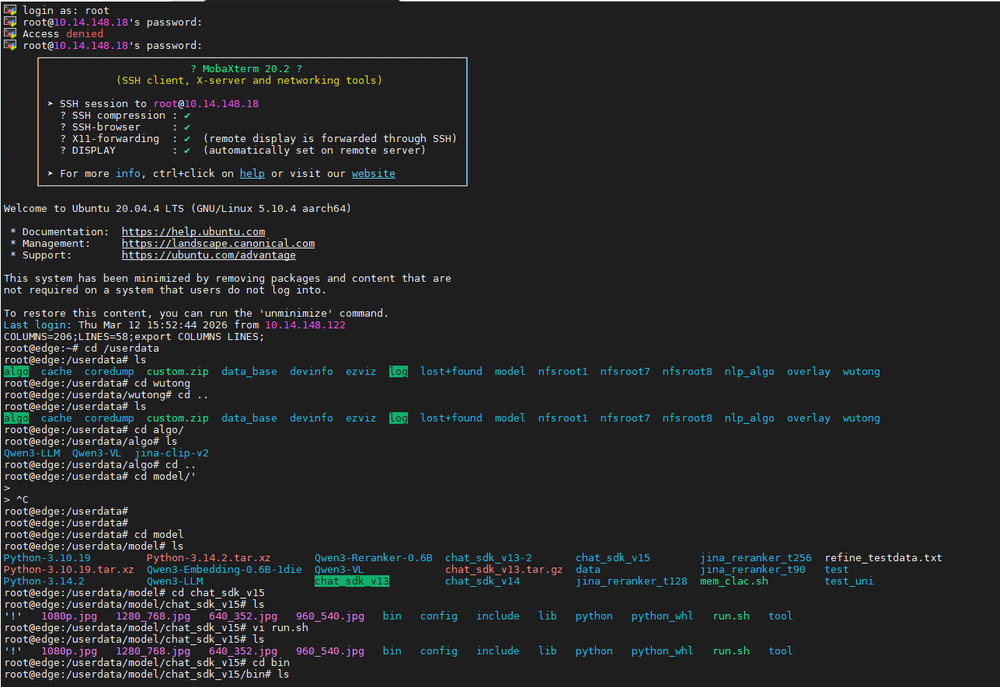
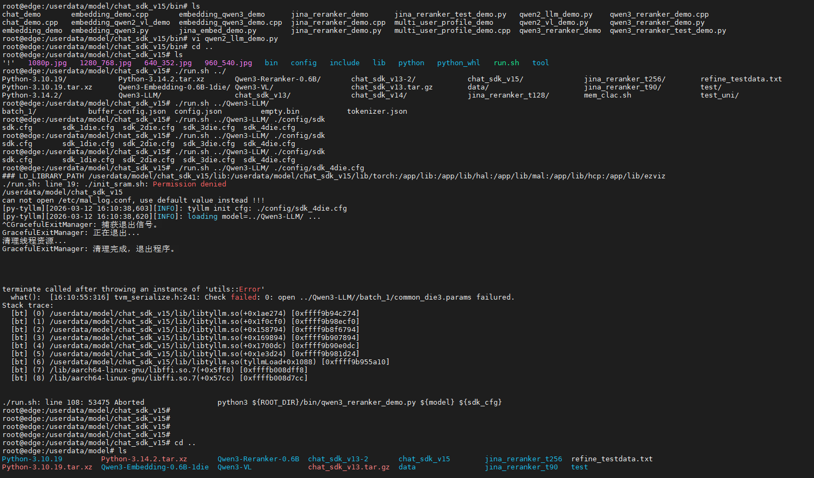
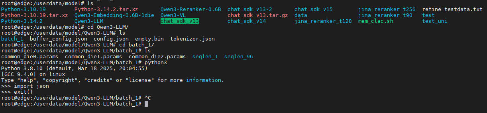

## 1、采用AWQ量化

好的，我们来详细了解一下 **AWQ（Activation-aware Weight Quantization，激活感知权重量化）** 算法。

AWQ 是一种先进的**训练后量化（Post-Training Quantization, PTQ）** 方法，专门为大型语言模型（LLMs）设计。它的核心目标是在**大幅减少模型存储空间和提升推理速度的同时，尽可能保持模型的原始性能**。

---

### 一、核心思想：权重并非同等重要

传统的量化方法（如 Round-To-Nearest）通常将所有权重一视同仁地进行低比特转换。但 AWQ 提出了一个关键洞见：**模型中的权重并非同等重要**。有一小部分“显著权重”（Salient Weights）对模型的输出质量有巨大影响。

*   **问题**：如果粗暴地对所有权重进行均匀量化，这些关键权重可能会因为量化误差而导致模型性能（如困惑度）显著下降。
*   **解决方案**：AWQ 的核心思想是 **“保护重要权重”**。即，在量化过程中，设法减少对这部分显著权重的量化误差。

### 二、如何识别重要权重？—— 利用“激活值”

AWQ 的创新之处在于它**不是通过权重本身的值大小（如绝对值）来判断其重要性，而是通过观察模型运行时“激活值”（Activation）的分布来间接判断**。

1.  **校准过程（Calibration）**：准备一个小型的、有代表性的校准数据集（例如，从训练集中抽取 128-512 个样本），让模型进行一次前向传播。
2.  **观察激活值**：在传播过程中，记录每一层输出的激活值（即特征图）。**激活值幅度大的通道（Channel）或神经元（Neuron），通常意味着其对输入的响应更强烈，其对应的权重也更为重要。**
3.  **锁定重要权重**：AWQ 认为，那些为高激活值通道“服务”的权重（即权重矩阵中与高激活值通道对应的行或列）就是需要保护的显著权重。

简单比喻：如果把模型推理比作一场音乐会，激活值就像是每个乐器的音量。音量越大的乐器（高激活值），其乐手（对应的权重）就越关键，我们需要确保这位乐手的乐器（权重）音准最佳（量化误差最小）。

### 三、如何保护重要权重？—— 权重缩放（Scaling）

AWQ 保护重要权重的方法非常巧妙：**在量化之前，对权重矩阵进行一个按通道（Per-Channel）的缩放变换**。

1.  **寻找缩放因子（s）**：对于每个输出通道，根据其激活值的幅度（例如，取该通道激活值的绝对值最大值），计算一个缩放因子 \( s \)（\( s > 1 \)）。**激活值越大的通道，其缩放因子 \( s \) 也越大。**
2.  **缩放权重**：将权重矩阵中对应通道的权重乘以这个缩放因子 \( s \)： \( W[:, j] = s_j \times W[:, j] \)。
3.  **量化**：然后对缩放后的权重进行标准的 INT4 或 INT3 量化。由于重要权重被放大了，它们在量化过程中相对的舍入误差就会变小，从而得到了“保护”。
4.  **反量化与补偿**：在推理时，对量化后的权重进行反量化后，需要再除以相同的缩放因子 \( s \) 来恢复原始数值范围。这个除法操作通常可以与该层后续的计算（如与激活值的矩阵乘）合并，从而**不引入额外的计算开销**。

**公式简化表示：**
\[
X \cdot W \approx X \cdot (s \cdot \frac{Q^{-1}(Q(s \cdot W))}{s}) = (X / s) \cdot Q^{-1}(Q(s \cdot W))
\]
（其中 \( Q \) 表示量化函数，\( Q^{-1} \) 表示反量化函数）

---

### 四、AWQ 的主要优势

1.  **保持性能**：通过保护显著权重，AWQ 在极低比特（如 W4A16，即权重4比特，激活值16比特）量化下，能非常接近原始 FP16 模型的性能，显著优于传统的 Round-To-Nearest 量化。
2.  **无需反向传播或重训练**：作为一种 PTQ 方法，AWQ 只需要少量校准数据做一次前向传播，无需昂贵的微调（Fine-tuning）或量化感知训练（QAT），速度快，易于部署。
3.  **泛化性强**：由于不依赖于在校准集上的误差重建，AWQ 不易过拟合到校准集，在不同领域和任务上表现出良好的泛化能力。
4.  **硬件友好**：AWQ 是 **权重量化（W4A16 或 W3A16）** 方案，激活值仍保持高精度。这与许多支持 INT4/INT8 权重和 FP16 激活值计算的高效推理硬件（如 NVIDIA Tensor Cores）非常匹配，能有效加速推理。

### 五、与 GPTQ 的对比

GPTQ 是另一个非常流行的 LLM PTQ 方法，它采用基于二阶信息（Hessian矩阵）的逐层重建误差最小化策略。

| 特性 | AWQ | GPTQ |
| :--- | :--- | :--- |
| **原理** | **激活感知**，保护重要权重 | **梯度/Hessian 感知**，最小化重建误差 |
| **方法** | 通过缩放进行隐式保护 | 通过贪心算法进行显式逐层优化 |
| **速度** | 量化过程通常**更快** | 量化过程相对较慢（尤其是大模型） |
| **精度** | 通用性强，在不同模型和任务上表现稳定 | 在校准集上重建精度高，但可能过拟合 |
| **硬件支持** | 与主流硬件兼容性好 | 同样兼容性好 |

两者都是顶尖的 PTQ 方案，选择哪一个取决于具体需求。目前，许多流行的模型仓库（如 Hugging Face）都会同时提供 AWQ 和 GPTQ 量化版本的模型。

### 总结

AWQ 通过其“**激活感知**”的聪明设计，在不引入额外训练成本的前提下，巧妙地识别并保护了对模型性能至关重要的少数权重，从而实现了**高效率、高性能的模型压缩与加速**，是大模型在资源受限的边缘设备上部署的关键技术之一。


## AWQ 优点的例子
# AWQ 量化技术详解（小白友好版）

你好！我来用通俗易懂的方式，带你从零开始理解 AWQ 量化技术。咱们一步步来，保证你能看懂！

---

## 一、先搞懂：什么是量化？为什么需要它？

### 🎯 量化的本质

想象一下，你有一本**超级厚的百科全书**（大语言模型），每个字都用**精美的彩色印刷**（FP16 浮点数，2 字节/参数）。这本书太厚太重了：

| 模型规模 | FP16 存储大小 | 需要显存 |
|---------|-------------|---------|
| 7B 参数 | 约 14 GB | 高端显卡 |
| 70B 参数 | 约 140 GB | 多卡服务器 |
| 32B 参数 | 约 64 GB | 4 张 4090 |

**量化**就是：把"彩色精美印刷"改成"黑白简印"（INT4 整数，0.5 字节/参数），书的内容基本不变，但体积缩小到**原来的 1/4**！

```
FP16 (16 比特) → INT4 (4 比特)
模型大小：64GB → 16GB
```

### 🤔 量化的挑战

但问题来了：**不是所有字都同等重要**！

- 如果把关键内容也简化了，书就读不懂了（精度下降）
- 如果只简化不重要的内容，就能既省空间又保持可读性

**AWQ 的核心思想就是：找出哪些"字"最重要，保护它们！**

---

## 二、AWQ 的核心发现：不是所有权重都平等

### 🔍 关键洞察

研究人员发现了一个惊人事实：

> **大模型中只有约 0.1%~1% 的权重对输出结果影响显著**

这些权重被称为**"显著权重"(Salient Weights)**

### 💡 AWQ 的突破

传统量化方法的问题是：
- ❌ 平等对待所有权重 → 关键信息丢失
- ❌ 根据权重大小判断重要性 → 判断不准确

**AWQ 的发现：**
- ✅ 应该根据**激活值(Activation)** 来判断权重重要性
- ✅ 激活值大的通道，对应的权重更关键

> **激活值** = 模型运行时中间计算的结果，可以理解为"这个神经元有多活跃"

---

## 三、用一个简单例子理解 AWQ

### 📐 普通量化的失败

假设有一个简单的计算：`Y = X × W`

```
输入激活 X = [1, 100]   # 第 2 个值很大
权重 W = [0.32, 0.32]   # 两个权重相同

原始输出：Y = (1×0.32) + (100×0.32) = 0.32 + 32.0 = 32.32
```

现在要把权重从浮点数量化为整数（四舍五入）：

```
量化后权重 W_int = [0, 0]  # 0.32 四舍五入变成 0

量化后输出：Y_quant = (1×0) + (100×0) = 0
```

**问题：** 结果从 32.32 变成 0，完全错了！

**原因：** 第 2 个激活值是 100，虽然权重误差只有 0.32，但被放大了 100 倍！

### ✨ AWQ 的解决方案

AWQ 使用**通道缩放**技巧：

```
数学原理：X × W = (X÷s) × (W×s)  # 结果不变！

AWQ 策略：
1. 找到大激活值的通道（第 2 个通道，激活=100）
2. 计算缩放因子 s（假设 s=10）
3. 权重放大：W' = W × s = [0.32, 3.2]
4. 激活缩小：X' = X ÷ s = [0.1, 10]
```

量化后：
```
W'_int = [0, 3]  # 3.2 四舍五入变成 3，保留了更多信息！
Y_quant = (0.1×0) + (10×3) = 30  # 接近原始值 32.32！
```

**效果：** 通过缩放，显著权重的量化误差大幅降低！

---

## 四、AWQ 的工作流程

```
┌─────────────────────────────────────────────────────────┐
│                    AWQ 量化流程                          │
├─────────────────────────────────────────────────────────┤
│  1️⃣ 分析激活                                              │
│     用少量校准数据运行模型，收集各层激活值分布              │
│     ↓                                                    │
│  2️⃣ 搜索缩放因子                                          │
│     为每个权重通道找到最优缩放因子 s，最小化量化误差         │
│     ↓                                                    │
│  3️⃣ 量化与保存                                            │
│     应用缩放因子，量化权重，保存模型和参数                  │
└─────────────────────────────────────────────────────────┘
```

### 🔧 关键技术点

| 技术 | 说明 |
|------|------|
| **激活感知** | 通过激活值分布识别重要权重通道 |
| **通道缩放** | 对显著权重通道放大，降低量化误差 |
| **统一量化** | 所有权重仍量化为同一精度（如 INT4），硬件友好 |
| **后训练量化** | 无需重新训练，只需少量校准数据 |

---

## 五、AWQ vs 其他量化方法

| 方法 | 量化方式 | 特点 | 适用场景 |
|------|---------|------|---------|
| **AWQ** | W4A16 | 激活感知保护显著权重，精度高 | 推荐首选 |
| **GPTQ** | W4A16 | 逐层量化优化，速度快 | 通用场景 |
| **SmoothQuant** | W8A8 | 同时量化权重+激活 | 激活值异常值多的场景 |
| **LLM.int8** | W8A8 | 混合精度处理异常值 | 需要激活量化时 |

> **W4A16** = 权重 4 比特，激活 16 比特  
> **W8A8** = 权重 8 比特，激活 8 比特

### 🏆 AWQ 的优势

```
✅ 精度损失小：INT4 量化精度损失 < 1%
✅ 硬件友好：统一量化，无需混合精度
✅ 无需训练：后训练量化，成本低
✅ 速度快：推理速度提升约 3 倍
✅ 显存省：显存占用减少约 3 倍
```

---

## 六、实际使用：AutoAWQ 工具

对于小白用户，推荐使用 **AutoAWQ** 工具，一键量化：

### 📦 安装
```bash
pip install autoawq
```

### 🔨 量化示例
```python
from awq import AutoAWQForCausalLM

# 加载模型
model = AutoAWQForCausalLM.from_pretrained(
    "Qwen/Qwen2-7B-Instruct",
    device_map="auto"
)

# 量化
model.quantize(
    quant_config={"w_bit": 4, "q_group_size": 128}
)

# 保存
model.save_quantized("qwen2-7b-awq-int4")
```

### 🚀 推理使用
```python
from awq import AutoAWQForCausalLM

model = AutoAWQForCausalLM.from_quantized(
    "qwen2-7b-awq-int4",
    device_map="auto"
)

# 正常推理，和原模型一样使用
```

---

## 七、什么时候用 AWQ？

### ✅ 推荐使用 AWQ 的场景

| 场景 | 说明 |
|------|------|
| **本地部署大模型** | 显存有限，需要压缩模型 |
| **边缘设备** | 手机、机器人等资源受限终端 |
| **长文本处理** | 降低 KV Cache 内存消耗 |
| **多模态模型** | 如 Qwen-VL 等视觉语言模型 |

### ⚠️ 注意事项

1. **校准集选择**：使用多样化数据，避免过拟合
2. **硬件适配**：不同芯片需调整量化参数
3. **激活瓶颈**：如果激活计算成为瓶颈，考虑 SmoothQuant

---

## 八、总结：AWQ 的核心要点

```
┌────────────────────────────────────────────────────┐
│              AWQ 一句话总结                         │
├────────────────────────────────────────────────────┤
│  通过激活值分布找出重要权重 → 缩放保护 → 低比特量化  │
│  实现：模型变小 + 速度变快 + 精度几乎不变            │
└────────────────────────────────────────────────────┘
```

### 🎓 关键概念回顾

| 概念 | 通俗理解 |
|------|---------|
| **量化** | 用更少比特存储参数，压缩模型 |
| **激活值** | 模型运行时的中间计算结果 |
| **显著权重** | 对输出影响大的关键权重（约 1%） |
| **通道缩放** | 放大重要权重，降低量化误差 |
| **后训练量化** | 无需重新训练，直接量化 |

---

希望这个解释能帮你理解 AWQ！如果还有任何不清楚的地方，欢迎继续提问 😊

---

### 量化工作细节和评估
使用TyQuant和TyLLM

## 2、量化模型格式转换
    **Content:**
    图片中的操作是**量化模型格式转换（Checkpoint Conversion）**。
    原因：
    1.  **推理兼容性**：量化过程中的 checkpoint 往往是中间格式（包含 fake quant 节点或特定的量化元数据），推理框架（如 vLLM, TensorRT 等）需要特定的格式。
    2.  **权重 packing**：低比特（如 4bit）需要打包存储以节省空间，转换脚本负责这一步。
    3.  **移除训练冗余**：去掉 optimizer state 等。
    4.  **精度特定处理**：w4a16 和 w4a8 存储结构不同。

    Looks good. I will formulate this into a coherent response.cw

图片中的内容展示了**量化模型格式转换**的步骤。对于量化之后的模型，之所以需要执行这一步操作，主要有以下几个核心原因：

### 1. 适配推理引擎（Deployment Compatibility）
量化训练或校准过程中生成的模型文件（Checkpoint）通常是**中间格式**。
- 它们可能包含“伪量化”节点（Fake Quantization Nodes），或者将量化参数（如 scale、zero_point）与权重分开存储。
- 大多数推理引擎（如 vLLM、TensorRT-LLM、ONNX Runtime 或特定的部署工具）无法直接加载这种中间格式。
- **转换目的**：通过 `checkpoint_convert.py` 脚本，将模型转换为推理引擎能够识别和加载的标准格式或特定优化格式。

### 2. 权重打包与存储优化（Weight Packing & Storage）
图片中提到了 `w4a16` 和 `w4a8` 等不同精度。
- **位宽打包**：例如在 4bit 量化（w4）中，为了节省显存和带宽，通常不会直接存储 4bit 的数据类型，而是将多个 4bit 权重打包到一个 8bit 或 32bit 的整数中。
- **转换目的**：转换脚本会执行具体的权重打包逻辑，确保模型文件在磁盘上的存储格式和在显存中的加载格式符合低比特推理的要求。

### 3. 清理冗余数据（Remove Redundancy）
训练或量化过程中的 Checkpoint 往往包含许多推理时不需要的信息。
- 例如：优化器状态（Optimizer States）、梯度信息、训练用的临时缓冲区等。
- **转换目的**：转换过程会剥离这些冗余数据，只保留推理所需的权重和量化参数，从而减小模型文件体积，加快加载速度。

### 4. 区分不同量化精度（Precision Specifics）
图片中分别列出了针对 `w4a16` 和 `w4a8` 的命令。
- 不同的量化精度（权重 4bit + 激活 16bit vs 权重 4bit + 激活 8bit）意味着模型内部的数据布局和量化参数结构是不同的。
- **转换目的**：需要针对不同的精度配置执行相应的转换逻辑，确保生成的模型文件正确反映该精度下的数学行为。

### 总结
简单来说，图片中的操作是**将“量化训练态”的模型转变为“量化推理态”模型的关键步骤**。如果不做这一步，量化后的模型通常无法直接用于生产环境的部署，或者无法发挥量化带来的性能优势（如显存节省和速度提升）。





