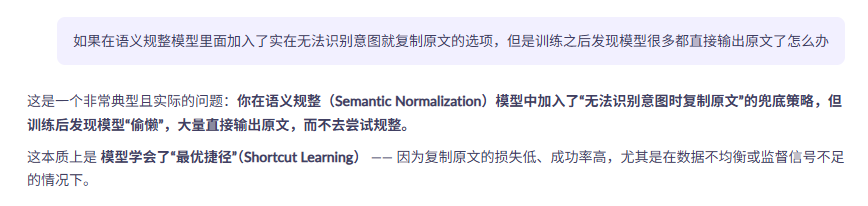
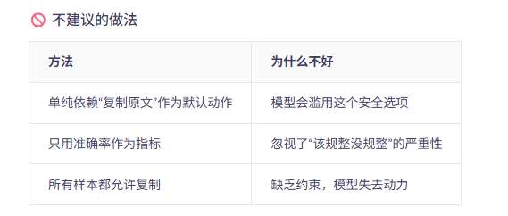
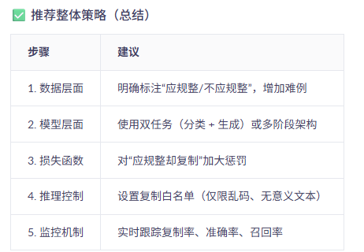
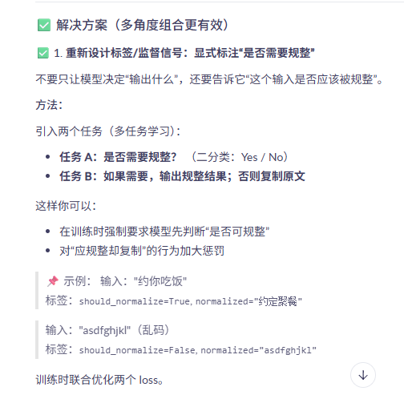
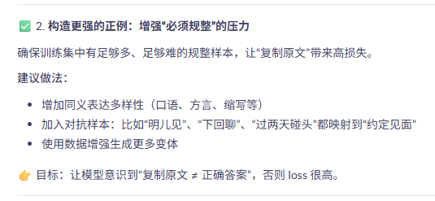
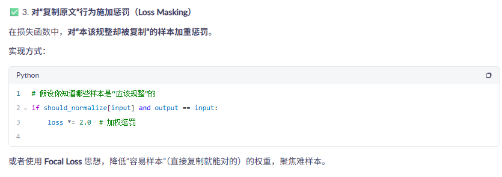
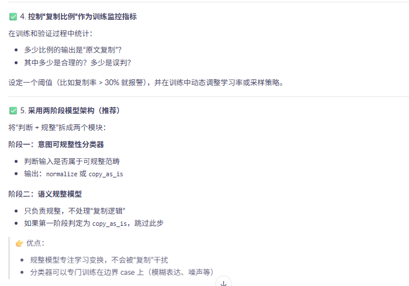
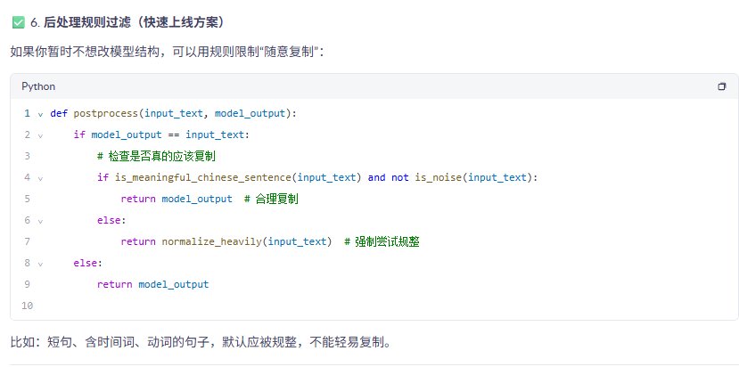
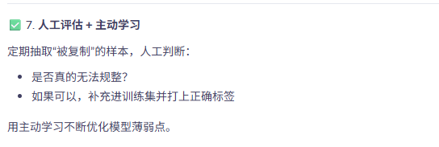

🔍 问题本质分析
你希望模型做到：

✅ 能识别的，就进行标准化改写（如：“明儿见” → “明天见面”）
❌ 实在无法理解/超出范围的，才原样复制
但模型学到了：

“只要我不确定，我就复制原文，这样就不会错。”

结果就是：模型倾向于把一切输入都当作“无法识别”，从而全盘复制。

这是典型的：
```
模型追求最小损失
缺乏对“何时该规整、何时该复制”的明确区分信号
训练数据中“需规整”样本不够强或不平衡
```
 

 

 

 

 

 

 

 

 

