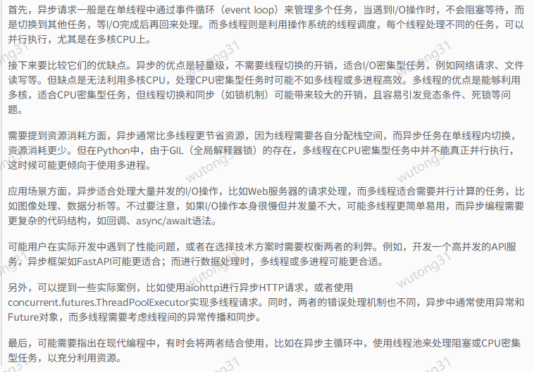
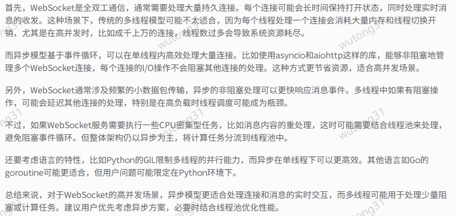

# 1、日志
```
def setup_logger(log_file='app.log', log_level=logging.DEBUG):
    # 参数=xx 代表的是默认值
    """
    配置日志记录器，同时输出到终端和文件
    """
    # 创建logger对象
    logger = logging.getLogger(__name__)
    logger.setLevel(log_level)
    
    # 防止重复添加handler
    if logger.handlers:
        logger.handlers = []
    
    # 设置日志格式
    formatter = logging.Formatter('%(asctime)s - %(name)s - %(levelname)s - %(message)s')
    
    """
    因为日志需要打印在控制台和存储在文件中，所以日志对象需要设置两个处理器
    """
    file_handler = logging.FileHandler(log_file, mode="a") #追加模式。不会每次执行都重新写入文件
    file_handler.setLevel(log_level)
    file_handler.setFormatter(formatter)
    
    console_handler = logging.StreamHandler(sys.stdout)
    console_handler.setLevel(log_level)
    console_handler.setFormatter(formatter)
    
    # 将handler添加到logger
    logger.addHandler(file_handler)
    logger.addHandler(console_handler)
    
    return logger
      
logger = setup_logger("xunfei.log", log_level=logging.INFO)

```
# 使用websocket进行定制化请求而不是sdk封装好的http请求
**异步通信还是多线程通信**






