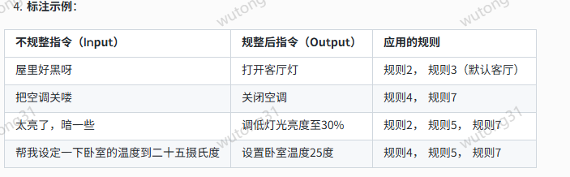

#### 智能家居指令语义规整标注规则 V1.0

核心原则：将用户指令转换为意图明确、对象精准、参数规范的短句。

标准格式：优先使用 [动作] [设备] [参数] 结构。

具体规则：
```
口语转正式：去除“吧”、“啦”、“哦”等语气词，将疑问句、感叹句改为直接祈使句。

补全省略：根据智能家居设备列表，为“这”、“那”、“它”等代词补充具体的设备名。若无明确指向，使用最常用的默认设备（如“主灯”、“空调”）。

统一词汇：使用统一的动词和名词词表（见附件《智能家居标准词表》）。

量化参数：将“有点”、“很”、“最大”等程度词转化为具体数值（如“亮度50%”、“温度18度”）。对于无法量化的，如“暗一点”，可规整为“调低亮度”。

删除冗余：删除礼貌用语、自我介绍（如“小爱同学”）、以及表达感受的句子，只保留核心指令部分。

```



针对您这个具体的场景——智能家居指令类语义规整，且仅有短文本、无上下文数据，我们来制定一个非常具体和可操作的规则方案。

这个任务的核心是：将用户可能存在的模糊、口语化、不完整或带有错误的指令，规整为标准、明确、设备可执行的指令格式。

第一步：明确规整的目标（定义“标准答案”）
---
 
在制定规则前，必须先定义什么是“规整后”的理想状态。对于智能家居指令，规整目标通常包括：

意图明确：指令的核心动作（如“打开”、“关闭”、“设置”、“查询”）必须清晰无误。
对象精准：指令作用的设备或场景（如“客厅主灯”、“空调”、“回家模式”）必须唯一确定。
参数完整：如有必要，参数（如温度“26度”、亮度“50%”）必须齐全且格式统一。
表述规范：消除口语化、歧义和冗余词，使用简洁、结构化的表达。
示例标准格式模板： [动作] [设备/区域] [参数]

例如：打开 客厅空调 设置温度26度

第二步：分析并分类常见的“不规整”类型（制定规则的基础）
---
您需要先对现有的“不规整”数据进行归类。以下是智能家居指令中常见的几类问题，每一类都对应一套规整规则。

类别一：口语化与省略

规则1：补全主语或宾语。

不规整：“太热了” -> 规整：“调低空调温度” 或 “打开空调”

不规整：“关了” -> 规整：“关闭客厅灯”（需结合领域知识，假设最常见操作）

规则2：将感叹句、疑问句转换为祈使句。

不规整：“怎么这么暗？” -> 规整：“调亮灯光”

不规整：“能不能开下灯？” -> 规整：“打开灯”

类别二：指代模糊与歧义

规则3：将模糊指代具体化。 这需要依赖您的智能家居系统的设备清单。

不规整：“打开那个灯” -> 规整：“打开餐桌灯”（假设用户最近操作或默认区域）

不规整：“调整一下温度” -> 规整：“调整空调温度”

关键：对于无法确定的指代，规整模型可以输出一个带有可能选项的澄清请求，但这会增加复杂度。初期可先规整为最可能的默认设备。

规则4：统一近义词。

“开/打开/开启” -> 统一为 “打开”

“关/关闭/关上” -> 统一为 “关闭”

“亮度/明暗” -> 统一为 “亮度”

“冷气/空调” -> 统一为 “空调”

类别三：参数不标准或缺失

规则5：规范参数格式。

不规整：“空调调到二十六度” -> 规整：“设置空调温度26度”

不规整：“灯弄暗一点” -> 规整：“调低灯光亮度至50%”（“一点”需要量化为一个标准值，如30%或50%）

规则6：补全默认参数。

不规整：“打开空调” -> 规整：“打开空调并设置温度24度”（如果您的系统有默认设置）

注意：此规则需谨慎，补全默认参数可能不符合用户预期。更安全的做法是保持“打开空调”，由执行端处理默认值。

类别四：指令冗余或包含无关信息

规则7：删除礼貌用语、语气词和冗余描述。

不规整：“嘿小爱同学，麻烦您帮我打开卧室的灯好吗？谢谢” -> 规整：“打开卧室灯”

不规整：“我现在觉得好冷啊，把暖气开开吧” -> 规整：“打开暖气”

---