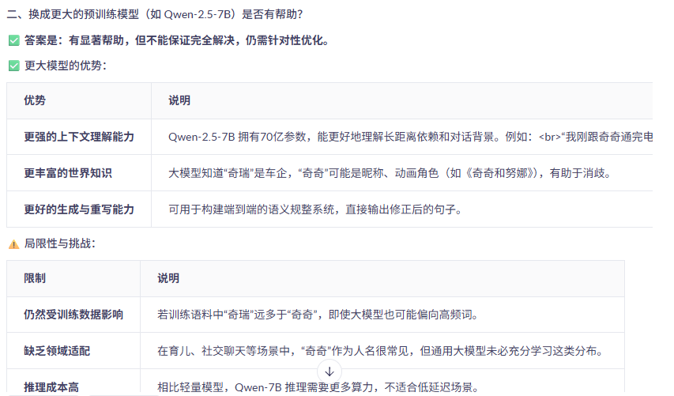
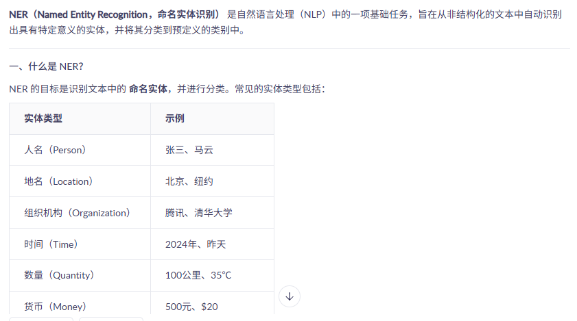
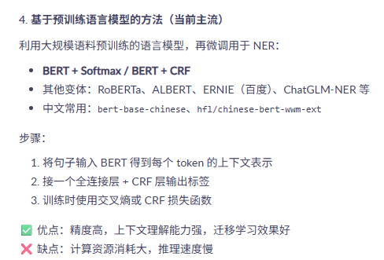
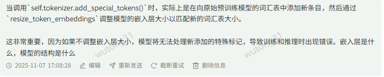
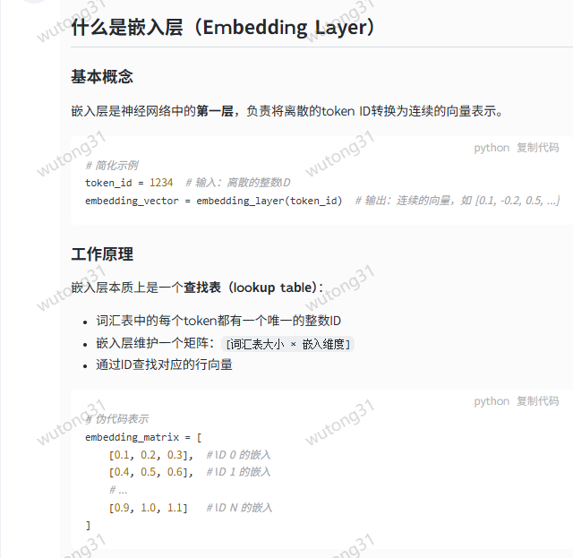
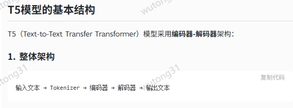
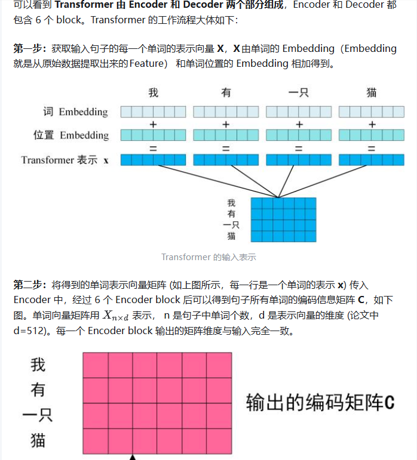
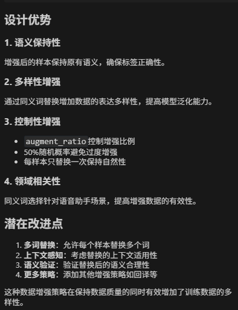

1、语义规整模型出现将‘打给奇奇’改写成‘打给奇瑞’”这一现象


**原因**：

**语音识别误差与语义理解偏差：-此条排除**

如果输入是语音转文字（如语音输入法或语音助手），"奇奇" 和 "奇瑞" 在中文发音上非常接近（均为 qí qí），语音识别系统可能无法准确区分。而“奇瑞”作为一个知名的汽车品牌（Chery），在语言模型训练数据中出现频率远高于“奇奇”（除非上下文明确指向人名或昵称），因此模型更倾向于将同音词“奇奇”纠正为高频词“奇瑞”。


**语义规整模型的先验知识偏好：接受**

语义规整模型的目标是将口语化、模糊或不规范的表达转化为更标准、合理或常见的表达。当模型检测到“打给奇奇”时，若缺乏上下文支持“奇奇”是一个人名或特定对象，它会基于概率判断：


“奇瑞”是现实中存在的实体（公司、品牌），具有更高的语义合理性；

“奇奇”作为人名虽常见，但在公共语料中出现频率较低，且容易被识别为儿语或昵称；

因此模型倾向于将其“规整”为更合理的实体“奇瑞”。


**上下文缺失导致歧义消除偏向高频词：**

在没有足够上下文的情况下（例如：“我刚刚打给奇奇”），模型无法判断“奇奇”是否为人名。为了减少歧义，语义规整模型通常会选择将低频、模糊词汇替换为高频、具体实体。这就是所谓的“默认实体映射”。


**训练数据偏差：**

大多数自然语言处理模型在训练时使用了大量互联网文本，其中“奇瑞汽车”相关内容远多于“奇奇”作为人名的用例。这种数据不平衡会导致模型对“qí qí”的解码偏向“奇瑞”。


**如何解决：**



  加入命名实体识别（NER）辅助判断加入命名实体识别（NER）辅助判断

  

  如何实现NER?（多种实现方式）
  


# 模型的结构
  



#### 具体流程
```
原始文本
    ↓ Tokenization
Token IDs (整数序列)
    ↓ 嵌入层
Token Embeddings (向量序列)
    ↓ 位置编码
位置感知的嵌入
    ↓ 编码器
上下文表示
    ↓ 解码器
输出概率分布

嵌入层在模型中的位置:
输入序列: ["Hello", "world"]
    ↓ Tokenizer
Token IDs: [123, 456]
    ↓ Embedding Layer
向量序列: [[0.1, 0.2, ...], [0.3, 0.4, ...]]
    ↓ 后续网络层...
```


## 如何提高模型改写的泛化性？

1、人为丰富数据集，加大数据量
2、采用数据增强策略，采用近义词替换策略

```
def augment_data(data: list, augment_ratio: float = 0.2) -> list:
    """数据增强策略"""
    augmented_data = data.copy()
    
    # 同义词替换字典
    synonyms = {
        "打电话": "拨打电话",
        "打开": "开启",
        "关闭": "关掉",
        "调高": "增大",
        "调低": "减小",
        "请": "",
        "帮我": "",
        "声音": "音量",
        "亮度": "屏幕亮度",
        "温度": "室内温度"
    }
    augmented_count = 0
    for item in data:
        if np.random.random() < augment_ratio:
            original = item['original']
            rewritten = item['rewritten']
            
            # 应用同义词替换
            for old, new in synonyms.items():
                if old in original and np.random.random() < 0.5:
                    new_original = original.replace(old, new)
                    if new_original != original:
                        augmented_item = {
                            'original': new_original,
                            'rewritten': rewritten,
                            'should_normalize': item['should_normalize']
                        }
                        augmented_data.append(augmented_item)
                        augmented_count += 1
                        break
    
    logger.info(f"数据增强: 原始 {len(data)} 条 -> 增强 {len(augmented_data)} 条 (新增 {augmented_count} 条)")
    return augmented_data
```
### 优点

