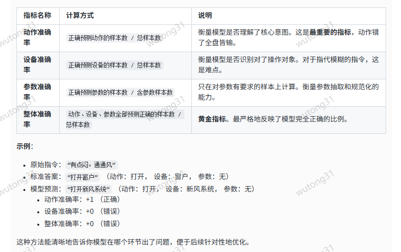

## 任务导向的分解评估指标
```
这是最核心、最推荐的评估方法。它将规整任务分解为几个关键组成部分，
分别进行精准评估，能直接反映模型在业务上的表现。
```
您需要定义三个核心要素的标签：

**动作
设备
参数**

评估流程：

对测试集中的每一条标准答案，人工标注出这三个要素的值。
使用模型对原始指令进行预测，得到规整后的指令。
使用一个简单的规则或模型（如正则表达式或一个小型分类器）从模型的输出中提取出这三个要素。
分别计算每个要素的准确率。



